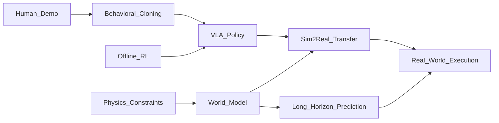

# 🧭 Imitation Learning & Human-Robot Interaction（Theme_Imitation_HRI）

## 🎯 主题定义
- 归属上位关键词：**Theme_Embodied_AI_System**
- 细分关注：imitation, learning from demonstration, HRI, human-robot, behavioral cloning
- 标准标签参考：#Imitation_Learning #HRI

## 📊 主题仪表盘
- 总论文数：**10**
- 平均分：**7.7**
- 高频标签：#Embodied_AI #Robot_Manipulation #World_Model #VLA #Reinforcement_Learning #Foundation_Model #Sim2Real #LLM #Diffusion_Model #Foundation_Models

## 🆕 最近新增
- [[Emerging Extrinsic Dexterity in Cluttered Scenes via Dynamicsaware Policy Learning]] | 2026-03-10 | Emerging Extrinsic Dexterity in Cluttered Scenes via Dynamics-aware Policy Learning
- [[MetaWorldX]] | 2026-03-09 | MetaWorld-X: Hierarchical World Modeling via VLM-Orchestrated Experts for Humanoid Loco-Manipulation
- [[Latent Particle World Models]] | 2026-03-04 | Latent Particle World Models: Self-supervised Object-centric Stochastic Dynamics Modeling
- [[RoboMME]] | 2026-03-04 | RoboMME: Benchmarking and Understanding Memory for Robotic Generalist Policies
- [[Chain of World]] | 2026-03-03 | Chain of World: World Model Thinking in Latent Motion
- [[ULTRA]] | 2026-03-03 | ULTRA: Unified Multimodal Control for Autonomous Humanoid Whole-Body Loco-Manipulation
- [[The_Trinity_of_Consistency_as_a_Defining_Principle_for_General_World_Models]] | 2026-02-26 | The Trinity of Consistency as a Defining Principle for General World Models
- [[Physics Informed Viscous Value Representations]] | 2026-02-26 | Physics Informed Viscous Value Representations

## ⭐ 核心论文 Top
- [[Chain of World]] | Score: 8/10 | 2026-03-03 | Chain of World: World Model Thinking in Latent Motion
- [[HybridVLA]] | Score: 8/10 | 2025-06-23 | HybridVLA: Collaborative Diffusion and Autoregression in a Unified Vision-Language-Action Model
- [[Latent Particle World Models]] | Score: 8/10 | 2026-03-04 | Latent Particle World Models: Self-supervised Object-centric Stochastic Dynamics Modeling
- [[MetaWorldX]] | Score: 8/10 | 2026-03-09 | MetaWorld-X: Hierarchical World Modeling via VLM-Orchestrated Experts for Humanoid Loco-Manipulation
- [[RoboMME]] | Score: 8/10 | 2026-03-04 | RoboMME: Benchmarking and Understanding Memory for Robotic Generalist Policies
- [[The_Trinity_of_Consistency_as_a_Defining_Principle_for_General_World_Models]] | Score: 8/10 | 2026-02-26 | The Trinity of Consistency as a Defining Principle for General World Models
- [[TICVLA]] | Score: 8/10 | 2026-02-02 | TIC-VLA: A Think-in-Control Vision-Language-Action Model for Robot Navigation in Dynamic Environments
- [[ULTRA]] | Score: 8/10 | 2026-03-03 | ULTRA: Unified Multimodal Control for Autonomous Humanoid Whole-Body Loco-Manipulation
- [[Emerging Extrinsic Dexterity in Cluttered Scenes via Dynamicsaware Policy Learning]] | Score: 7/10 | 2026-03-10 | Emerging Extrinsic Dexterity in Cluttered Scenes via Dynamics-aware Policy Learning
- [[Physics Informed Viscous Value Representations]] | Score: 6/10 | 2026-02-26 | Physics Informed Viscous Value Representations

## ✅ 核心贡献与共识
- 暂无可提取的核心贡献，待深度分析笔记积累后自动汇总。

## ⚠️ 局限性与关键分歧
- 暂未发现显式局限性记录，待深度分析笔记积累后自动汇总。

## 🔀 跨论文引用网络
- [[ProbeFlow]] ← 被 [[HybridVLA]] 等 1 篇引用
- [[PPGuide]] ← 被 [[HybridVLA]] 等 1 篇引用
- [[Not All Features Are Created Equal]] ← 被 [[HybridVLA]] 等 1 篇引用
- [[World_Action_Models_are_Zero_shot_Policies]] ← 被 [[The_Trinity_of_Consistency_as_a_Defining_Principle_for_General_World_Models]] 等 1 篇引用
- [[Physics Informed Viscous Value Representations]] ← 被 [[The_Trinity_of_Consistency_as_a_Defining_Principle_for_General_World_Models]] 等 1 篇引用
- [[GeneralVLA]] ← 被 [[The_Trinity_of_Consistency_as_a_Defining_Principle_for_General_World_Models]] 等 1 篇引用
- [[QuantVLA]] ← 被 [[The_Trinity_of_Consistency_as_a_Defining_Principle_for_General_World_Models]] 等 1 篇引用
- [[Code2Worlds]] ← 被 [[The_Trinity_of_Consistency_as_a_Defining_Principle_for_General_World_Models]] 等 1 篇引用

## 🏛️ 领域里程碑工作（AI Enriched）
- **DAgger: A Reduction of Imitation Learning and Structured Prediction to No-Regret Online Learning (2011, AISTATS)** — Established the foundational online aggregation framework to mitigate covariate shift in behavioral cloning.
- **Generative Adversarial Imitation Learning (2016, NeurIPS)** — Introduced GAIL, framing imitation learning as a distribution matching problem via adversarial training.
- **One-Shot Imitation Learning (2017, NeurIPS)** — Pioneered meta-learning approaches for rapid task adaptation from a single demonstration.
- **Behavioral Cloning from Observation (2018, IJCAI)** — Addressed the challenge of learning policies from passive video demonstrations without explicit action labels.
- **ACT: Action Chunking with Transformers (2023, CoRL)** — Introduced temporal action chunking to stabilize transformer-based behavioral cloning for long-horizon manipulation tasks.
- **RT-1: Robotics Transformer for Real-World Control at Scale (2022, CoRL)** — Scaled behavioral cloning to massive multi-task datasets using efficient transformer architectures for real-world deployment.
- **Diffusion Policy: Visuomotor Policy Learning via Action Diffusion (2023, RSS)** — Replaced deterministic action heads with diffusion models, significantly improving multi-modal action distribution learning in imitation.
- **VoxPoser: Composable 3D Value Maps for Robotic Manipulation with Language Models (2023, CoRL)** — Bridged LLMs and imitation learning by using language to generate spatial affordance maps for zero-shot manipulation.
- **Octo: An Open-Source Generalist Robot Policy (2024, RSS)** — Demonstrated that a single transformer trained on diverse datasets can generalize across robot morphologies and tasks via large-scale imitation.
- **OpenVLA: An Open-Source Vision-Language-Action Model (2024, arXiv)** — Democratized large-scale VLA training, establishing open benchmarks for imitation-based robotic control.
- **Learning Fine-Grained Bimanual Manipulation with Low-Cost Hardware (2023, RSS)** — Demonstrated that teleoperation-driven imitation learning can achieve high dexterity using affordable, open-source hardware setups.
- **Mobile ALOHA: Learning Bimanual Mobile Manipulation with Low-Cost Whole-Body Teleoperation (2024, arXiv)** — Extended imitation learning to mobile platforms, enabling complex whole-body coordination through scalable human demonstration collection.

## 🚀 前沿信号雷达（AI Enriched）
- **Chain of World** 与 **Latent Particle World Models** 代表了将隐式世界模型引入模仿学习的趋势，通过构建环境动态的潜在表征来支持长程策略推理，降低对连续人类演示数据的依赖。
- **HybridVLA** 与 **RoboMME** 凸显了视觉语言动作模型（VLA）与扩散模型（Diffusion Model）的深度融合趋势，利用多模态大模型的语义理解能力增强行为克隆（Behavioral Cloning）的零样本泛化性能。
- **TICVLA** 与 **ULTRA** 反映了 Sim2Real 迁移与强化学习（Reinforcement Learning）在模仿学习中的交叉趋势，通过环境一致性约束与策略微调，解决真实物理交互中的分布偏移问题。
- **Physics Informed Viscous Value Representations** 展示了将物理先验（Physics-Informed）引入离线强化学习与价值函数学习的趋势，为高维连续控制任务提供更稳定的策略优化基础。

## 🧬 体系化关联补充（AI Enriched）
- **Theme_Imitation_HRI 与 Theme_World_Model 的桥梁**：通过 **Chain of World** 和 **MetaWorldX** 等研究，将环境动态建模与策略学习解耦，利用世界模型生成的反事实轨迹扩充专家演示数据，提升长程任务的样本效率。
- **Theme_Imitation_HRI 与 Theme_Foundation_Models 的桥梁**：**RoboMME** 与 **HybridVLA** 建立了多模态大模型与行为克隆的映射机制，利用预训练视觉语言模型的语义表征对齐人类意图与机器人底层动作空间。
- **Theme_Imitation_HRI 与 Theme_Offline_Reinforcement_Learning 的桥梁**：**Physics Informed Viscous Value Representations** 提供了将人类演示转化为离线强化学习数据集的标准化接口，通过引入物理先验约束价值函数，缓解分布外（OOD）动作的累积误差。
- **Theme_Imitation_HRI 与 Theme_Sim2Real 的桥梁**：**TICVLA** 与 **ULTRA** 构建了基于仿真演示的策略蒸馏管道，利用环境一致性正则化与域适应技术，将人类在虚拟环境中的交互技能无缝迁移至真实物理系统。

## ❓ 开放性问题（AI Enriched）
- 针对世界模型（World Models）在长程任务中普遍存在的累积预测误差问题，如何在不依赖大规模真实交互数据的前提下，利用人类演示（Demonstration）的稀疏反馈有效校准动力学分布偏移？
- 面对视觉-语言-动作模型（VLA）在复杂 cluttered 场景中泛化能力受限的瓶颈，如何设计轻量级的物理一致性约束以替代昂贵的在线强化学习微调，从而缓解 Sim2Real 的域差异？
- 在离线强化学习与模仿学习结合时，当人类演示存在多模态歧义或执行噪声，如何量化解耦“高层意图一致性”与“底层轨迹偏差”，以提升策略在未见环境中的鲁棒性？

## 🗺️ 主题关系可视化（AI Enriched）

## 🗓️ 本周推进建议（AI Enriched）
- [ ] 聚焦论文《Latent Particle World Models》：在Jupyter中使用PyTorch搭建一个基于VAE的潜在状态编码器与单步MLP动力学预测器，在MuJoCo的Pendulum-v1环境中训练。观察并记录潜在空间轨迹与真实物理状态轨迹的MSE随预测步长（1~10步）的发散曲线，验证世界模型短期预测的误差累积特性。
- [ ] 聚焦论文《Physics Informed Viscous Value Representations》：在CartPole环境中实现一个带物理正则化的Critic网络，将系统能量守恒项作为L2惩罚加入损失函数。对比标准DQN与加入物理约束后的版本，绘制价值函数在状态空间上的3D热力图，观察并测量价值曲面在边界区域的平滑度与梯度突变次数。
- [ ] 聚焦论文《HybridVLA》：使用2D网格坐标模拟机械臂末端执行器，编写一个基于DDPM的轻量级行为克隆策略（代码控制在150行内）。在固定演示数据集上训练，调整扩散过程的噪声调度参数，记录生成动作轨迹的方差变化，并计算生成轨迹与专家演示轨迹之间的动态时间规整（DTW）距离以评估模仿精度。

## 🔗 关联主题
- [[Theme_Robot_Manipulation_General|Robot Manipulation]]
- [[Theme_Foundation_LLM|Foundation LLMs & Language Models]]
- [[Theme_Dexterous_Contact|Dexterous Manipulation & Contact Dynamics]]
