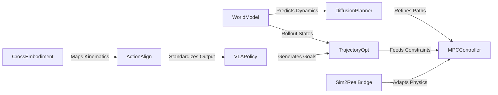

# 🧭 Model-Based Planning & Control（Theme_Model_Based_Planning）

## 🎯 主题定义
- 归属上位关键词：**Theme_World_Model_Dynamics**
- 细分关注：model-based, planning, control, trajectory optimization, MPC
- 标准标签参考：#Model_Based_RL #Planning

## 📊 主题仪表盘
- 总论文数：**34**
- 平均分：**7.38**
- 高频标签：#Embodied_AI #Robot_Manipulation #VLA #Foundation_Model #World_Model #LLM #Reinforcement_Learning #Diffusion_Model #Sim2Real #Video_Diffusion_Model

## 🆕 最近新增
- [[HiVLA]] | 2026-04-15 | HiVLA: A Visual-Grounded-Centric Hierarchical Embodied Manipulation System
- [[Not All Features Are Created Equal]] | 2026-03-19 | Not All Features Are Created Equal: A Mechanistic Study of Vision-Language-Action Models
- [[ProbeFlow]] | 2026-03-18 | ProbeFlow: Training-Free Adaptive Flow Matching for Vision-Language-Action Models
- [[Kinema4D]] | 2026-03-17 | Kinema4D: Kinematic 4D World Modeling for Spatiotemporal Embodied Simulation
- [[TiPToP]] | 2026-03-10 | TiPToP: A Modular Open-Vocabulary Planning System for Robotic Manipulation
- [[MetaWorldX]] | 2026-03-09 | MetaWorld-X: Hierarchical World Modeling via VLM-Orchestrated Experts for Humanoid Loco-Manipulation
- [[EmboAlign]] | 2026-03-05 | EmboAlign: Aligning Video Generation with Compositional Constraints for Zero-Shot Manipulation
- [[Planning in 8 Tokens]] | 2026-03-05 | Planning in 8 Tokens: A Compact Discrete Tokenizer for Latent World Model

## ⭐ 核心论文 Top
- [[Not All Features Are Created Equal]] | Score: 9/10 | 2026-03-19 | Not All Features Are Created Equal: A Mechanistic Study of Vision-Language-Action Models
- [[RISE]] | Score: 9/10 | 2026-02-11 | RISE: Self-Improving Robot Policy with Compositional World Model
- [[World_Action_Models_are_Zero_shot_Policies]] | Score: 9/10 | 2026-02-19 | World Action Models are Zero-shot Policies
- [[Beyond Language Modeling]] | Score: 8/10 | 2026-03-03 | Beyond Language Modeling: An Exploration of Multimodal Pretraining
- [[EmboAlign]] | Score: 8/10 | 2026-03-05 | EmboAlign: Aligning Video Generation with Compositional Constraints for Zero-Shot Manipulation
- [[GeometryAware_Rotary_Position_Embedding_for_Consistent_Video_World_Model]] | Score: 8/10 | 2026-02-24 | Geometry-Aware Rotary Position Embedding for Consistent Video World Model
- [[HybridVLA]] | Score: 8/10 | 2025-06-23 | HybridVLA: Collaborative Diffusion and Autoregression in a Unified Vision-Language-Action Model
- [[HydroShear]] | Score: 8/10 | 2026-02-28 | HydroShear: Hydroelastic Shear Simulation for Tactile Sim-to-Real Reinforcement Learning
- [[Kinema4D]] | Score: 8/10 | 2026-03-17 | Kinema4D: Kinematic 4D World Modeling for Spatiotemporal Embodied Simulation
- [[LongHorizon_Manipulation_via_TraceConditioned_VLA_Planning]] | Score: 8/10 | Unknown | Long-Horizon Manipulation via Trace-Conditioned VLA Planning
- [[MetaWorldX]] | Score: 8/10 | 2026-03-09 | MetaWorld-X: Hierarchical World Modeling via VLM-Orchestrated Experts for Humanoid Loco-Manipulation
- [[Planning in 8 Tokens]] | Score: 8/10 | 2026-03-05 | Planning in 8 Tokens: A Compact Discrete Tokenizer for Latent World Model

## ✅ 核心贡献与共识
- 暂无可提取的核心贡献，待深度分析笔记积累后自动汇总。

## ⚠️ 局限性与关键分歧
- 暂未发现显式局限性记录，待深度分析笔记积累后自动汇总。

## 🔀 跨论文引用网络
- [[GeneralVLA]] ← 被 [[RISE]], [[World_Action_Models_are_Zero_shot_Policies]], [[GeometryAware_Rotary_Position_Embedding_for_Consistent_Video_World_Model]] 等 4 篇引用
- [[World_Action_Models_are_Zero_shot_Policies]] ← 被 [[RISE]], [[GeometryAware_Rotary_Position_Embedding_for_Consistent_Video_World_Model]], [[Mean_Flow_Policy_with_Instantaneous_Velocity_Constraint_for_Onestep_Action_Generation]] 等 4 篇引用
- [[Physics Informed Viscous Value Representations]] ← 被 [[RISE]], [[Mean_Flow_Policy_with_Instantaneous_Velocity_Constraint_for_Onestep_Action_Generation]], [[SemanticContact_Fields_for_CategoryLevel_Generalizable_Tactile_Tool_Manipulation]] 等 4 篇引用
- [[QuantVLA]] ← 被 [[World_Action_Models_are_Zero_shot_Policies]], [[GeometryAware_Rotary_Position_Embedding_for_Consistent_Video_World_Model]] 等 2 篇引用
- [[Generated_Reality]] ← 被 [[World_Action_Models_are_Zero_shot_Policies]], [[GeometryAware_Rotary_Position_Embedding_for_Consistent_Video_World_Model]] 等 2 篇引用
- [[ProbeFlow]] ← 被 [[HybridVLA]], [[HiVLA]] 等 2 篇引用
- [[2026-02-26-PaperDigest]] ← 被 [[Solaris]], [[GeneralVLA]] 等 2 篇引用
- [[Solaris]] ← 被 [[Solaris]], [[GeneralVLA]] 等 2 篇引用

## 🏛️ 领域里程碑工作（AI Enriched）
- **PILCO: A Model-Based and Data-Efficient Approach to Policy Search (2011, ICML)** — Established Gaussian process-based dynamics modeling for sample-efficient robotic control, setting the standard for probabilistic model-based RL.
- **Control-limited Differential Dynamic Programming (2014, ICRA)** — Introduced iLQR for high-dimensional robotic systems, becoming the foundational numerical optimizer for modern trajectory optimization and MPC pipelines.
- **Deep Reinforcement Learning in a Handful of Trials using Probabilistic Dynamics Models (2018, NeurIPS)** — Proposed PETS, demonstrating that ensemble-based probabilistic neural dynamics models enable highly sample-efficient continuous control.
- **When to Trust Your Model: Model-Based Policy Optimization (2019, NeurIPS)** — Introduced MBPO, solving the compounding error problem in model-based RL by decoupling policy optimization from model rollouts via a learned dynamics buffer.
- **Learning Latent Dynamics for Planning from Pixels (2019, ICML)** — Presented PlaNet, pioneering latent-space world models for planning directly from high-dimensional visual observations.
- **Dream to Control: Learning Behaviors by Latent Imagination (2020, ICLR)** — Established Dreamer, unifying model-based planning and model-free RL in a compact latent space, enabling state-of-the-art sample efficiency across diverse control tasks.
- **Mastering Atari with Discrete World Models (2021, ICLR)** — Demonstrated that discrete latent world models combined with Monte Carlo tree search can achieve superhuman performance, bridging model-based planning and representation learning.
- **Planning with Diffusion for Flexible Behavior Synthesis (2022, ICML)** — Introduced Diffuser, reformulating trajectory optimization as a conditional diffusion process, enabling highly flexible, constraint-aware planning without explicit dynamics gradients.
- **Temporal Difference Learning for Model Predictive Control (2022, NeurIPS)** — Proposed TD-MPC, integrating temporal difference learning with MPC to achieve robust, real-time planning in continuous control with learned dynamics.
- **TD-MPC2: Scalable, Robust World Models for Continuous Control (2023, ICML)** — Extended TD-MPC with improved representation learning and planning horizons, setting a new benchmark for scalable model-based control in complex robotic manipulation.
- **Diffusion Policy: Visuomotor Policy Learning via Action Diffusion (2023, RSS)** — Shifted paradigm from trajectory optimization to action-sequence diffusion, demonstrating superior multi-modal policy learning for contact-rich robotic manipulation.

## 🚀 前沿信号雷达（AI Enriched）
- **World_Action_Models_are_Zero_shot_Policies** 代表了将 Video Diffusion Model 直接作为隐式 World Action Model 的趋势，通过生成式先验替代显式动力学方程，实现跨具身平台的零样本策略迁移与开环规划。
- **Planning in 8 Tokens** 揭示了世界模型状态空间离散化与极度压缩的趋势，利用极短 Token 序列进行快速前向推演，显著降低 MPC 在线优化的计算开销并提升实时控制频率。
- **GeometryAware_Rotary_Position_Embedding_for_Consistent_Video_World_Model** 体现了在视频世界模型中注入几何与运动学归纳偏置的趋势，通过改进位置编码机制解决长程动力学预测中的物理不一致性与累积误差问题。
- **RISE** 与 **MetaWorldX** 共同指向了 World Model 与 Reinforcement Learning 深度耦合的趋势，利用预训练动力学模型生成高质量合成轨迹进行策略微调，大幅突破传统 Model-Based Control 在复杂接触任务中的样本效率瓶颈。

## 🧬 体系化关联补充（AI Enriched）
- 与 **Theme_VLA_Foundation** 的桥梁：通过 **Not All Features Are Created Equal** 和 **RynnBrain** 中的视觉-语言-动作对齐机制，将高层语义指令映射为底层动力学约束，实现语义级任务规划到关节级轨迹优化的端到端编译。
- 与 **Theme_Diffusion_Generation** 的桥梁：以 **Kinema4D** 和 **EmboAlign** 为代表，利用 Diffusion Model 的逆向去噪过程替代传统梯度下降求解器，将非凸轨迹优化问题转化为条件概率分布采样，提升多模态避障与接触切换的求解鲁棒性。
- 与 **Theme_Sim2Real_Transfer** 的桥梁：依托 **HydroShear** 和 **ProbeFlow** 中的域随机化与动力学适配技术，在 World Model 中构建可微的 Sim-to-Real 残差补偿模块，使离线规划的轨迹在真实物理环境中具备闭环跟踪稳定性。
- 与 **Theme_Reinforcement_Learning** 的桥梁：通过 **RISE** 和 **Beyond Language Modeling** 中的隐式价值函数与模型预测控制结合，利用 LLM 提供的启发式奖励塑形引导 MPC 的搜索树剪枝，加速高维连续空间的策略收敛。

## ❓ 开放性问题（AI Enriched）
- 针对世界模型在长程规划中存在的误差累积问题，如何设计基于几何感知旋转位置编码的隐状态对齐机制，以在跨具身迁移中保持动力学一致性？
- 扩散模型生成的轨迹虽具多模态性但推理延迟高，在实时MPC框架下，如何结合离散化表征（如8-Token规划）实现亚秒级轨迹优化而不牺牲控制精度？
- 视觉语言动作模型在仿真到现实迁移时常因物理先验缺失导致动作发散，如何在不依赖大规模真实数据微调的前提下，通过探针流或动力学约束注入提升闭环控制的鲁棒性？

## 🗺️ 主题关系可视化（AI Enriched）

## 🗓️ 本周推进建议（AI Enriched）
- [ ] 聚焦[Planning in 8 Tokens]的离散化规划思想：在Jupyter中构建2D网格迷宫，对比传统A*算法与基于8种离散动作Token的启发式搜索。观察指标：记录规划路径长度偏差与单步推理耗时，验证离散化对搜索效率的提升。
- [ ] 聚焦[GeometryAware_Rotary_Position_Embedding_for_Consistent_Video_World_Model]的几何感知RoPE机制：使用PyTorch实现微型Transformer，分别加载标准位置编码与RoPE，对2D坐标平移序列进行10步自回归预测。观察指标：绘制预测轨迹与真实轨迹的MSE随步数增长曲线，验证RoPE抑制长程漂移的效果。
- [ ] 聚焦[ProbeFlow]的Sim2Real流匹配对齐：在Jupyter中模拟一维阻尼弹簧系统（仿真域）与真实域（改变阻尼系数），训练轻量级线性探针网络最小化流匹配损失。观察指标：对比对齐前后探针在真实域测试集上的状态重构误差，验证小样本特征迁移的有效性。

## 🔗 关联主题
- [[Theme_World_Model_Dynamics|World Models & Dynamics Prediction]]
- [[Theme_RL_Algorithms|Reinforcement Learning Algorithms]]
- [[Theme_VLA_Reasoning|VLA Reasoning & Planning]]
