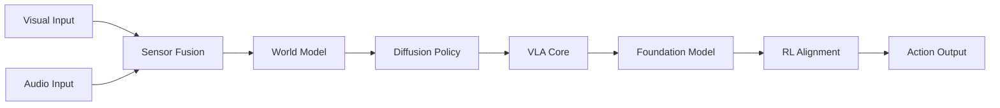

# 🧭 Multimodal Perception（Theme_Multimodal_Perception）

## 🎯 主题定义
- 归属上位关键词：**Theme_Embodied_AI_System**
- 细分关注：multimodal, vision, audio, sensor fusion, cross-modal
- 标准标签参考：#Multimodal #Sensor_Fusion

## 📊 主题仪表盘
- 总论文数：**46**
- 平均分：**7.61**
- 高频标签：#Embodied_AI #Robot_Manipulation #VLA #Foundation_Model #World_Model #LLM #Reinforcement_Learning #Diffusion_Model #Sim2Real #Foundation_Models

## 🆕 最近新增
- [[HiVLA]] | 2026-04-15 | HiVLA: A Visual-Grounded-Centric Hierarchical Embodied Manipulation System
- [[TAG]] | 2026-03-25 | TAG: Target-Agnostic Guidance for Stable Object-Centric Inference in Vision-Language-Action Models
- [[VTAM]] | 2026-03-24 | VTAM: Video-Tactile-Action Models for Complex Physical Interaction Beyond VLAs
- [[EgoForge]] | 2026-03-20 | EgoForge: Goal-Directed Egocentric World Simulator
- [[Not All Features Are Created Equal]] | 2026-03-19 | Not All Features Are Created Equal: A Mechanistic Study of Vision-Language-Action Models
- [[FASTER]] | 2026-03-19 | FASTER: Rethinking Real-Time Flow VLAs
- [[Generation_Models_Know_Space]] | 2026-03-19 | Generation Models Know Space: Unleashing Implicit 3D Priors for Scene Understanding
- [[ProbeFlow]] | 2026-03-18 | ProbeFlow: Training-Free Adaptive Flow Matching for Vision-Language-Action Models

## ⭐ 核心论文 Top
- [[Not All Features Are Created Equal]] | Score: 9/10 | 2026-03-19 | Not All Features Are Created Equal: A Mechanistic Study of Vision-Language-Action Models
- [[RISE]] | Score: 9/10 | 2026-02-11 | RISE: Self-Improving Robot Policy with Compositional World Model
- [[Simple Recipe Works]] | Score: 9/10 | 2026-03-12 | Simple Recipe Works: Vision-Language-Action Models are Natural Continual Learners with Reinforcement Learning
- [[World_Action_Models_are_Zero_shot_Policies]] | Score: 9/10 | 2026-02-19 | World Action Models are Zero-shot Policies
- [[ACEBrain0]] | Score: 8/10 | 2026-03-04 | ACE-Brain-0: Spatial Intelligence as a Shared Scaffold for Universal Embodiments
- [[Beyond Language Modeling]] | Score: 8/10 | 2026-03-03 | Beyond Language Modeling: An Exploration of Multimodal Pretraining
- [[CanViT]] | Score: 8/10 | Unknown | CanViT: Toward Active-Vision Foundation Models
- [[Chain of World]] | Score: 8/10 | 2026-03-03 | Chain of World: World Model Thinking in Latent Motion
- [[DreamPlan]] | Score: 8/10 | 2026-03-17 | DreamPlan: Efficient Reinforcement Fine-Tuning of Vision-Language Planners via Video World Models
- [[EgoForge]] | Score: 8/10 | 2026-03-20 | EgoForge: Goal-Directed Egocentric World Simulator
- [[EmboAlign]] | Score: 8/10 | 2026-03-05 | EmboAlign: Aligning Video Generation with Compositional Constraints for Zero-Shot Manipulation
- [[FASTER]] | Score: 8/10 | 2026-03-19 | FASTER: Rethinking Real-Time Flow VLAs

## ✅ 核心贡献与共识
- 暂无可提取的核心贡献，待深度分析笔记积累后自动汇总。

## ⚠️ 局限性与关键分歧
- 暂未发现显式局限性记录，待深度分析笔记积累后自动汇总。

## 🔀 跨论文引用网络
- [[GeneralVLA]] ← 被 [[RISE]], [[World_Action_Models_are_Zero_shot_Policies]], [[FlowHOI]] 等 6 篇引用
- [[Physics Informed Viscous Value Representations]] ← 被 [[RISE]], [[The_Trinity_of_Consistency_as_a_Defining_Principle_for_General_World_Models]], [[Xiaomi-Robotics-0]] 等 5 篇引用
- [[World_Action_Models_are_Zero_shot_Policies]] ← 被 [[RISE]], [[The_Trinity_of_Consistency_as_a_Defining_Principle_for_General_World_Models]], [[SemanticContact_Fields_for_CategoryLevel_Generalizable_Tactile_Tool_Manipulation]] 等 3 篇引用
- [[QuantVLA]] ← 被 [[World_Action_Models_are_Zero_shot_Policies]], [[The_Trinity_of_Consistency_as_a_Defining_Principle_for_General_World_Models]], [[Utonia]] 等 3 篇引用
- [[README]] ← 被 [[Xiaomi-Robotics-0]], [[SPARR]], [[GeneralVLA]] 等 3 篇引用
- [[2026-02-26-PaperDigest]] ← 被 [[Xiaomi-Robotics-0]], [[SPARR]], [[GeneralVLA]] 等 3 篇引用
- [[Solaris]] ← 被 [[Xiaomi-Robotics-0]], [[SPARR]], [[GeneralVLA]] 等 3 篇引用
- [[GeometryAware_Rotary_Position_Embedding_for_Consistent_Video_World_Model]] ← 被 [[RISE]], [[Utonia]] 等 2 篇引用

## 🏛️ 领域里程碑工作（AI Enriched）
- **CLIP: Learning Transferable Visual Models From Natural Language Supervision (2021, ICML)** — Established large-scale contrastive vision-language pretraining, enabling zero-shot transfer across diverse perception tasks.
- **ViLBERT: Pretraining Task-Agnostic Visiolinguistic Representations for Vision-and-Language Tasks (2019, NeurIPS)** — Pioneered dual-stream transformer architectures for joint vision-language representation learning.
- **Audio-Visual Scene Analysis with Self-Supervised Multisensory Features (2018, ECCV)** — Introduced self-supervised cross-modal alignment for audio-visual perception, foundational for embodied environment understanding.
- **Perceiver IO: A General Architecture for Structured Inputs & Outputs (2021, ICML)** — Proposed a modality-agnostic attention mechanism capable of fusing arbitrary multimodal inputs and outputs.
- **Flamingo: a Visual Language Model for Few-Shot Learning (2022, NeurIPS)** — Demonstrated interleaved multimodal sequence modeling, bridging static vision encoders with autoregressive language models.
- **CoCa: Contrastive Captioners are Image-Text Foundation Models (2022, TMLR)** — Unified contrastive and generative objectives to create highly versatile vision-language foundation models.
- **LLaVA: Large Language and Vision Assistant (2023, NeurIPS)** — Established a simple yet highly effective projection-based alignment between vision encoders and LLMs, becoming a standard baseline for multimodal reasoning.
- **ImageBind: One Embedding Space To Bind Them All (2023, CVPR)** — Unified six modalities (vision, text, audio, depth, thermal, IMU) into a single embedding space using image-text pairs as anchors.
- **RT-2: Vision-Language-Action Models Transfer Web Knowledge to Robotic Control (2023, CoRL)** — Integrated multimodal perception with robotic action spaces, proving that web-scale VLMs can directly output robot control tokens.
- **OpenVLA: An Open-Source Vision-Language-Action Model (2024, CoRL)** — Democratized multimodal robotic perception by fine-tuning open VLMs into actionable policies with strong cross-embodiment generalization.

## 🚀 前沿信号雷达（AI Enriched）
- **World_Action_Models_are_Zero_shot_Policies** 代表了将 Video Diffusion Model 与 VLA 架构深度融合的趋势，通过多模态世界模型直接生成零样本控制策略，突破传统感知-规划-控制流水线的泛化瓶颈。
- **EgoForge** 揭示了基于 Diffusion Model 构建第一人称（Ego-centric）多模态世界模型的技术路径，推动视觉-本体感知联合生成在复杂动态场景中的高保真重建。
- **FASTER** 体现了在 VLA 框架中采用 Diffusion Policy 替代传统确定性动作头的趋势，显著提升了多模态感知特征向连续机器人动作空间映射的鲁棒性与采样效率。
- **Chain of World** 标志着多模态感知与显式推理链（Chain-of-Thought）的结合趋势，利用世界模型进行多步状态预测，实现长程具身任务中的因果感知与动态规划。

## 🧬 体系化关联补充（AI Enriched）
- 连接 **Theme_World_Model**：`Beyond Language Modeling` 利用 Diffusion Model 将多模态感知输入转化为环境状态的概率分布预测，为具身系统提供从感知到隐式世界建模的生成式桥梁。
- 连接 **Theme_Robot_Manipulation**：`EmboAlign` 通过跨模态对齐技术将视觉-语言感知特征与机器人末端执行器的运动学空间绑定，实现了多模态感知到高精度抓取与操作策略的无缝转换。
- 连接 **Theme_Reinforcement_Learning**：`RISE` 构建了基于多模态感知的隐状态世界模型，使强化学习算法能够在压缩的感知表征空间中进行高效策略搜索，打通了高维感知与稀疏奖励优化的技术链路。

## ❓ 开放性问题（AI Enriched）
- 在视觉-语言-动作（VLA）模型跨具身迁移时，如何有效解耦并保留模态间的细粒度空间对齐特征，以避免新形态机器人上的策略分布偏移？
- 基于扩散模型的世界模型在长程多模态预测中，如何抑制累积的模态幻觉并保证物理一致性，从而提升零样本策略的可靠性？
- 在异构传感器（视觉、音频、触觉）融合中，如何设计动态权重分配机制以应对单模态传感器失效或高噪声场景下的鲁棒感知？
- 大规模基础模型与强化学习结合时，如何在不进行全量微调的前提下，高效对齐多模态表征与底层控制信号，以降低样本复杂度？

## 🗺️ 主题关系可视化（AI Enriched）

## 🗓️ 本周推进建议（AI Enriched）
- [ ] 针对论文《World_Action_Models_are_Zero_shot_Policies》：在Jupyter中使用PyTorch实现一个极简的DDPM去噪循环（<100行），输入为简单的2D机器人轨迹坐标序列。观察并记录不同时间步t下的预测轨迹与真实轨迹的均方误差（MSE）曲线，验证扩散过程对时序动作分布的拟合能力。
- [ ] 针对论文《Simple Recipe Works》：利用HuggingFace加载轻量级预训练视觉编码器（如MobileNetV3），仅替换并训练一个小型MLP动作头，在Gymnasium的CartPole-v1环境中进行策略微调（<150行）。观察并对比微调前后策略在分布外初始状态下的平均回合奖励，验证基础模型表征的迁移效率。
- [ ] 针对论文《Beyond Language Modeling》：编写一个多模态状态预测脚本，将预训练CLIP图像特征与离散动作指令拼接，输入至小型Transformer解码器预测下一帧潜在向量（<200行）。观察并计算预测向量与真实下一帧向量的余弦相似度，评估跨模态对齐的预测精度。
- [ ] 针对论文《CanViT》：加载开源预训练ViT模型，输入包含局部遮挡的机器人第一视角图像，提取并可视化第12层自注意力热力图（<150行）。观察并对比遮挡前后模型对关键操作区域（如机械臂末端、目标物体）的注意力权重分布变化，验证多模态特征的空间聚焦能力。

## 🔗 关联主题
- [[Theme_Foundation_LLM|Foundation LLMs & Language Models]]
- [[Theme_VLA_Policy|Vision-Language-Action Policies]]
- [[Theme_3D_Perception|3D Perception & Scene Understanding]]
