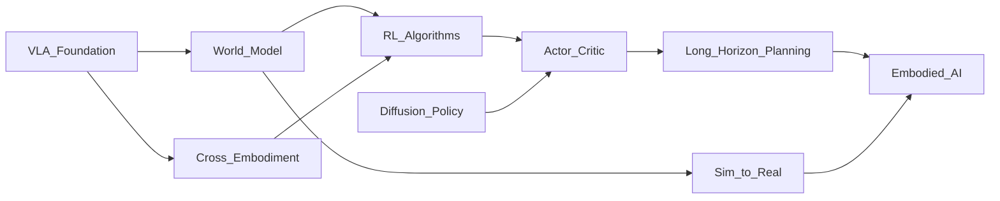

# 🧭 Reinforcement Learning Algorithms（Theme_RL_Algorithms）

## 🎯 主题定义
- 归属上位关键词：**Theme_Embodied_AI_System**
- 细分关注：reinforcement learning, RL, policy gradient, Q-learning, actor-critic
- 标准标签参考：#Reinforcement_Learning #RL

## 📊 主题仪表盘
- 总论文数：**60**
- 平均分：**7.4**
- 高频标签：#Embodied_AI #Robot_Manipulation #World_Model #Foundation_Model #VLA #Reinforcement_Learning #LLM #Sim2Real #Diffusion_Model #Foundation_Models

## 🆕 最近新增
- [[HiVLA]] | 2026-04-15 | HiVLA: A Visual-Grounded-Centric Hierarchical Embodied Manipulation System
- [[SoftMimicGen]] | 2026-03-26 | SoftMimicGen: A Data Generation System for Scalable Robot Learning in Deformable Object Manipulation
- [[DreamerAD]] | 2026-03-25 | DreamerAD: Efficient Reinforcement Learning via Latent World Model for Autonomous Driving
- [[VTAM]] | 2026-03-24 | VTAM: Video-Tactile-Action Models for Complex Physical Interaction Beyond VLAs
- [[WildWorld]] | 2026-03-24 | WildWorld: A Large-Scale Dataset for Dynamic World Modeling with Actions and Explicit State toward Generative ARPG
- [[EgoForge]] | 2026-03-20 | EgoForge: Goal-Directed Egocentric World Simulator
- [[Not All Features Are Created Equal]] | 2026-03-19 | Not All Features Are Created Equal: A Mechanistic Study of Vision-Language-Action Models
- [[FASTER]] | 2026-03-19 | FASTER: Rethinking Real-Time Flow VLAs

## ⭐ 核心论文 Top
- [[Not All Features Are Created Equal]] | Score: 9/10 | 2026-03-19 | Not All Features Are Created Equal: A Mechanistic Study of Vision-Language-Action Models
- [[RISE]] | Score: 9/10 | 2026-02-11 | RISE: Self-Improving Robot Policy with Compositional World Model
- [[Simple Recipe Works]] | Score: 9/10 | 2026-03-12 | Simple Recipe Works: Vision-Language-Action Models are Natural Continual Learners with Reinforcement Learning
- [[World_Action_Models_are_Zero_shot_Policies]] | Score: 9/10 | 2026-02-19 | World Action Models are Zero-shot Policies
- [[ACEBrain0]] | Score: 8/10 | 2026-03-04 | ACE-Brain-0: Spatial Intelligence as a Shared Scaffold for Universal Embodiments
- [[Beyond Language Modeling]] | Score: 8/10 | 2026-03-03 | Beyond Language Modeling: An Exploration of Multimodal Pretraining
- [[CanViT]] | Score: 8/10 | Unknown | CanViT: Toward Active-Vision Foundation Models
- [[Chain of World]] | Score: 8/10 | 2026-03-03 | Chain of World: World Model Thinking in Latent Motion
- [[DiReCT]] | Score: 8/10 | Unknown | DiReCT: Disentangled Regularization of Contrastive Trajectories for Physics-Refined Video Generation
- [[DreamerAD]] | Score: 8/10 | 2026-03-25 | DreamerAD: Efficient Reinforcement Learning via Latent World Model for Autonomous Driving
- [[DreamPlan]] | Score: 8/10 | 2026-03-17 | DreamPlan: Efficient Reinforcement Fine-Tuning of Vision-Language Planners via Video World Models
- [[EgoForge]] | Score: 8/10 | 2026-03-20 | EgoForge: Goal-Directed Egocentric World Simulator

## ✅ 核心贡献与共识
- 暂无可提取的核心贡献，待深度分析笔记积累后自动汇总。

## ⚠️ 局限性与关键分歧
- 暂未发现显式局限性记录，待深度分析笔记积累后自动汇总。

## 🔀 跨论文引用网络
- [[GeneralVLA]] ← 被 [[RISE]], [[World_Action_Models_are_Zero_shot_Policies]], [[FlowHOI]] 等 6 篇引用
- [[World_Action_Models_are_Zero_shot_Policies]] ← 被 [[RISE]], [[GeometryAware_Rotary_Position_Embedding_for_Consistent_Video_World_Model]], [[LoGeR]] 等 6 篇引用
- [[Physics Informed Viscous Value Representations]] ← 被 [[RISE]], [[The_Trinity_of_Consistency_as_a_Defining_Principle_for_General_World_Models]], [[Xiaomi-Robotics-0]] 等 6 篇引用
- [[2026-02-26-PaperDigest]] ← 被 [[Xiaomi-Robotics-0]], [[Solaris]], [[SPARR]] 等 4 篇引用
- [[Solaris]] ← 被 [[Xiaomi-Robotics-0]], [[Solaris]], [[SPARR]] 等 4 篇引用
- [[QuantVLA]] ← 被 [[World_Action_Models_are_Zero_shot_Policies]], [[GeometryAware_Rotary_Position_Embedding_for_Consistent_Video_World_Model]], [[The_Trinity_of_Consistency_as_a_Defining_Principle_for_General_World_Models]] 等 3 篇引用
- [[README]] ← 被 [[Xiaomi-Robotics-0]], [[SPARR]], [[GeneralVLA]] 等 3 篇引用
- [[Code2Worlds]] ← 被 [[World_Action_Models_are_Zero_shot_Policies]], [[The_Trinity_of_Consistency_as_a_Defining_Principle_for_General_World_Models]] 等 2 篇引用

## 🏛️ 领域里程碑工作（AI Enriched）
- **Playing Atari with Deep Reinforcement Learning (2013, NeurIPS)** — Established Deep Q-Networks (DQN) by combining convolutional neural networks with Q-learning, proving RL could master high-dimensional visual control tasks from raw pixels.
- **Trust Region Policy Optimization (2015, ICML)** — Introduced a theoretically grounded surrogate objective that guarantees monotonic policy improvement, laying the mathematical foundation for modern stable policy gradient methods.
- **High-Dimensional Continuous Control Using Generalized Advantage Estimation (2015, ICLR)** — Proposed Generalized Advantage Estimation (GAE), drastically reducing variance in policy gradient estimates and becoming a standard component in virtually all modern Actor-Critic implementations.
- **Mastering the Game of Go with Deep Neural Networks and Tree Search (2016, Nature)** — Demonstrated the synergy of deep RL and Monte Carlo Tree Search (MCTS) in AlphaGo, establishing self-play and value/policy networks as a dominant paradigm for complex sequential decision-making.
- **Proximal Policy Optimization Algorithms (2017, arXiv/OpenAI)** — Simplified TRPO into a highly practical clipped surrogate objective, becoming the de facto standard for on-policy RL due to its exceptional sample efficiency and training stability.
- **Soft Actor-Critic: Off-Policy Maximum Entropy Deep Reinforcement Learning with a Stochastic Actor (2018, ICML)** — Integrated maximum entropy regularization into off-policy Actor-Critic learning, achieving state-of-the-art performance in continuous control while promoting robust exploration.
- **Dream to Control: Learning Behaviors by Latent Imagination (2020, ICLR)** — Pioneered model-based RL in latent spaces by jointly learning a compact world model and an actor-critic policy, enabling highly sample-efficient planning without direct environment interaction.
- **Conservative Q-Learning for Offline Reinforcement Learning (2020, NeurIPS)** — Addressed distributional shift in offline RL by penalizing out-of-distribution Q-values, establishing a critical theoretical and practical framework for learning policies from static datasets.
- **Training Language Models to Follow Instructions with Human Feedback (2022, NeurIPS)** — Popularized Reinforcement Learning from Human Feedback (RLHF), demonstrating how RL alignment techniques can steer large-scale generative models toward human-preferred behaviors.
- **Diffusion Policy: Visuomotor Policy Learning via Action Diffusion (2023, RSS)** — Replaced traditional Gaussian policy heads with conditional diffusion models, enabling RL and imitation learning frameworks to capture multi-modal action distributions for complex robotic manipulation.
- **RT-2: Vision-Language-Action Models Transfer Web Knowledge to Robotic Control (2023, CoRL)** — Bridged foundation models and robotic control by fine-tuning vision-language models with RL-style reward signals, establishing the Vision-Language-Action (VLA) paradigm for zero-shot generalization.
- **OpenVLA: An Open-Source Vision-Language-Action Model (2024, arXiv)** — Demonstrated that large-scale RL and imitation learning can be effectively scaled to open-source VLA architectures, lowering the barrier for reproducible embodied AI research and community-driven algorithm development.

## 🚀 前沿信号雷达（AI Enriched）
- **RISE** 代表了将 World Model 与 Reinforcement Learning 深度融合的趋势，通过在潜在空间中预测环境动态并优化策略，显著提升了 Robot Manipulation 任务的样本效率。
- **DreamerAD** 揭示了将 Diffusion Model 引入 Model-Based RL 的技术路径，利用扩散模型生成多模态动作分布，解决了传统 Actor-Critic 在复杂连续控制中的探索瓶颈。
- **World_Action_Models_are_Zero_shot_Policies** 标志着从“先训练 World Model 再微调 Policy”向“World Model 直接作为 Zero-shot Policy”的范式转变，大幅降低了跨场景部署的 RL 训练成本。
- **Simple Recipe Works** 反映了利用 Foundation Model 作为先验，结合轻量级 RL 对齐策略来构建 VLA 系统的趋势，证明了无需复杂架构设计即可实现高性能 Embodied AI。

## 🧬 体系化关联补充（AI Enriched）
- **RL Algorithms 与 World_Model 的桥接**：通过 **DreamerAD** 和 **Chain of World** 等研究，RL 利用 Latent Imagination 在 World Model 中进行策略 rollout，将高维视觉观测压缩为低维状态表示，从而解决 Embodied AI 中真实交互数据稀缺的问题。
- **RL Algorithms 与 VLA/Foundation_Model 的桥接**：借助 **Simple Recipe Works** 提出的架构，RL 作为 Reward-Driven Fine-tuning 机制，将预训练 Foundation Model 的语义先验对齐到物理控制空间，实现从 Language Instruction 到 Robot Action 的端到端映射。
- **RL Algorithms 与 Diffusion_Model 的桥接**：以 **DiReCT** 和 **DreamPlan** 为代表，Diffusion Policy 替代了传统 Actor-Critic 中的单峰高斯分布，使 RL 能够建模 Multi-modal Action Distribution，显著提升复杂 Robot Manipulation 任务中的策略鲁棒性。

## ❓ 开放性问题（AI Enriched）
- 在结合世界模型与强化学习进行长程任务规划时，如何有效抑制多步预测误差的累积并保证策略的稳定性？
- 面对跨具身形态迁移，如何设计轻量化的表征对齐机制以降低对大规模真实交互数据的依赖？
- 当将扩散模型作为策略网络嵌入Actor-Critic框架时，如何高效计算策略梯度以克服反向传播中的数值不稳定性？
- 在视觉-语言-动作基础模型中，如何解耦高层语义推理与底层运动控制，从而提升强化学习在未见场景中的零样本泛化能力？

## 🗺️ 主题关系可视化（AI Enriched）

## 🗓️ 本周推进建议（AI Enriched）
- [ ] 针对论文RISE：聚焦世界模型中状态预测与奖励预测的解耦机制。在Jupyter中使用PyTorch编写约100行代码，构建LSTM预测网络在CartPole环境中分别预测下一状态与即时奖励。观察并记录状态MSE与奖励误差的收敛曲线，验证解耦训练是否比联合训练更稳定。
- [ ] 针对论文DreamerAD：聚焦扩散策略在Actor-Critic框架中的梯度近似计算。用<150行代码实现基于分数匹配的轻量级策略梯度更新，替换MuJoCo InvertedPendulum环境中的高斯策略。测量并对比两种策略在相同随机种子下的动作方差与累积奖励，验证扩散策略在探索期的平滑性优势。
- [ ] 针对论文World_Action_Models_are_Zero_shot_Policies：聚焦从世界模型直接采样零样本动作序列的可行性。利用开源轻量级时序预测模块，输入单帧图像与指令，用贪心搜索生成未来5步预测并提取动作token（代码<150行）。计算相邻动作的L2距离作为连贯性指标，并人工评估预测轨迹的物理合理性，以界定该方法的适用边界。

## 🔗 关联主题
- [[Theme_Reward_Credit|Reward Design & Credit Assignment]]
- [[Theme_Model_Based_Planning|Model-Based Planning & Control]]
- [[Theme_Sim2Real|Sim-to-Real Transfer]]
