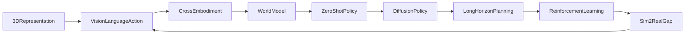

# 🧭 Robot Manipulation（Theme_Robot_Manipulation_General）

## 🎯 主题定义
- 归属上位关键词：**Theme_Embodied_AI_System**
- 细分关注：manipulation, grasping, pick and place, robotic arm, end-effector, gripper
- 标准标签参考：#Robot_Manipulation #Grasping

## 📊 主题仪表盘
- 总论文数：**47**
- 平均分：**7.55**
- 高频标签：#Robot_Manipulation #Embodied_AI #VLA #Foundation_Model #World_Model #Reinforcement_Learning #Sim2Real #Diffusion_Model #LLM #3D_Gaussian_Splatting

## 🆕 最近新增
- [[HiVLA]] | 2026-04-15 | HiVLA: A Visual-Grounded-Centric Hierarchical Embodied Manipulation System
- [[SoftMimicGen]] | 2026-03-26 | SoftMimicGen: A Data Generation System for Scalable Robot Learning in Deformable Object Manipulation
- [[TAG]] | 2026-03-25 | TAG: Target-Agnostic Guidance for Stable Object-Centric Inference in Vision-Language-Action Models
- [[VTAM]] | 2026-03-24 | VTAM: Video-Tactile-Action Models for Complex Physical Interaction Beyond VLAs
- [[Not All Features Are Created Equal]] | 2026-03-19 | Not All Features Are Created Equal: A Mechanistic Study of Vision-Language-Action Models
- [[FASTER]] | 2026-03-19 | FASTER: Rethinking Real-Time Flow VLAs
- [[Generation_Models_Know_Space]] | 2026-03-19 | Generation Models Know Space: Unleashing Implicit 3D Priors for Scene Understanding
- [[ProbeFlow]] | 2026-03-18 | ProbeFlow: Training-Free Adaptive Flow Matching for Vision-Language-Action Models

## ⭐ 核心论文 Top
- [[Not All Features Are Created Equal]] | Score: 9/10 | 2026-03-19 | Not All Features Are Created Equal: A Mechanistic Study of Vision-Language-Action Models
- [[RISE]] | Score: 9/10 | 2026-02-11 | RISE: Self-Improving Robot Policy with Compositional World Model
- [[Simple Recipe Works]] | Score: 9/10 | 2026-03-12 | Simple Recipe Works: Vision-Language-Action Models are Natural Continual Learners with Reinforcement Learning
- [[World_Action_Models_are_Zero_shot_Policies]] | Score: 9/10 | 2026-02-19 | World Action Models are Zero-shot Policies
- [[ACEBrain0]] | Score: 8/10 | 2026-03-04 | ACE-Brain-0: Spatial Intelligence as a Shared Scaffold for Universal Embodiments
- [[Chain of World]] | Score: 8/10 | 2026-03-03 | Chain of World: World Model Thinking in Latent Motion
- [[DreamPlan]] | Score: 8/10 | 2026-03-17 | DreamPlan: Efficient Reinforcement Fine-Tuning of Vision-Language Planners via Video World Models
- [[EmboAlign]] | Score: 8/10 | 2026-03-05 | EmboAlign: Aligning Video Generation with Compositional Constraints for Zero-Shot Manipulation
- [[FASTER]] | Score: 8/10 | 2026-03-19 | FASTER: Rethinking Real-Time Flow VLAs
- [[FlowHOI]] | Score: 8/10 | 2026-02-13 | FlowHOI: Flow-based Semantics-Grounded Generation of Hand-Object Interactions for Dexterous Robot Manipulation
- [[Generation_Models_Know_Space]] | Score: 8/10 | 2026-03-19 | Generation Models Know Space: Unleashing Implicit 3D Priors for Scene Understanding
- [[HybridVLA]] | Score: 8/10 | 2025-06-23 | HybridVLA: Collaborative Diffusion and Autoregression in a Unified Vision-Language-Action Model

## ✅ 核心贡献与共识
- 暂无可提取的核心贡献，待深度分析笔记积累后自动汇总。

## ⚠️ 局限性与关键分歧
- 暂未发现显式局限性记录，待深度分析笔记积累后自动汇总。

## 🔀 跨论文引用网络
- [[GeneralVLA]] ← 被 [[RISE]], [[World_Action_Models_are_Zero_shot_Policies]], [[FlowHOI]] 等 5 篇引用
- [[Physics Informed Viscous Value Representations]] ← 被 [[RISE]], [[Xiaomi-Robotics-0]], [[Mean_Flow_Policy_with_Instantaneous_Velocity_Constraint_for_Onestep_Action_Generation]] 等 5 篇引用
- [[World_Action_Models_are_Zero_shot_Policies]] ← 被 [[RISE]], [[LoGeR]], [[Mean_Flow_Policy_with_Instantaneous_Velocity_Constraint_for_Onestep_Action_Generation]] 等 4 篇引用
- [[README]] ← 被 [[Xiaomi-Robotics-0]], [[SPARR]], [[GeneralVLA]] 等 3 篇引用
- [[2026-02-26-PaperDigest]] ← 被 [[Xiaomi-Robotics-0]], [[SPARR]], [[GeneralVLA]] 等 3 篇引用
- [[Solaris]] ← 被 [[Xiaomi-Robotics-0]], [[SPARR]], [[GeneralVLA]] 等 3 篇引用
- [[GeometryAware_Rotary_Position_Embedding_for_Consistent_Video_World_Model]] ← 被 [[RISE]], [[Utonia]] 等 2 篇引用
- [[QuantVLA]] ← 被 [[World_Action_Models_are_Zero_shot_Policies]], [[Utonia]] 等 2 篇引用

## 🏛️ 领域里程碑工作（AI Enriched）
- **GraspIt! (2004, IEEE RAM)** — Established the first comprehensive simulation framework for grasp planning and analysis, laying the mathematical and computational groundwork for analytical grasp quality metrics.
- **Dex-Net 2.0 (2017, RSS)** — Pioneered the integration of synthetic data generation with deep learning for robust grasp detection, fundamentally shifting the field from analytical heuristics to data-driven perception.
- **QT-Opt (2018, CoRL)** — Demonstrated the scalability of self-supervised deep reinforcement learning for real-world robotic grasping, proving that massive parallel data collection could overcome sample inefficiency.
- **GraspNet-1Billion (2020, CVPR)** — Introduced a large-scale, densely annotated dataset for 6-DoF grasp detection, becoming the de facto standard benchmark for evaluating learning-based manipulation pipelines.
- **RT-1 (2022, CoRL)** — Scaled up transformer-based policy learning to over 130k real-world demonstrations, establishing tokenized action representations as a highly efficient paradigm for multi-task manipulation.
- **Diffusion Policy (2023, RSS)** — Established action diffusion as a superior paradigm for multimodal visuomotor policy learning, significantly improving robustness and trajectory smoothness in complex contact-rich tasks.
- **ACT (2023, CoRL)** — Introduced action chunking with transformers to mitigate compounding errors in imitation learning, becoming a foundational architecture for modern teleoperation and bimanual manipulation datasets.
- **RT-2 (2023, CoRL)** — Integrated vision-language models with robotic control, enabling zero-shot generalization and semantic reasoning in manipulation through web-scale pretraining and emergent reasoning capabilities.
- **OpenVLA (2024, arXiv)** — Democratized VLA research by releasing an open, fine-tunable 7B-parameter model, accelerating community-driven manipulation benchmarks and lowering the barrier to entry for academic labs.
- **Octo (2024, RSS)** — Demonstrated a generalist robot policy trained on diverse, multi-robot datasets, establishing cross-embodiment transfer and unified action tokenization as key frontiers in scalable manipulation.

## 🚀 前沿信号雷达（AI Enriched）
- World_Action_Models_are_Zero_shot_Policies] 将 Video Diffusion Model 与世界动作模型深度融合，标志着操作策略从依赖显式奖励函数向基于生成式世界模型的零样本跨本体迁移演进。
- FASTER] 在 VLA 架构中引入 Diffusion Model 进行动作解码，反映了当前通过概率生成模型提升多模态指令到连续控制信号映射鲁棒性的技术趋势。
- FlowHOI] 结合 3D Gaussian Splatting 与 VLA 进行场景表征，体现了利用高保真神经渲染技术突破传统点云/RGB输入局限，实现精细空间关系推理的操作前沿。
- DreamPlan] 利用 World Model 进行长程操作任务的隐式规划与轨迹预测，代表了通过内部仿真推演降低真实环境交互成本、提升样本效率的主流方向。

## 🧬 体系化关联补充（AI Enriched）
- 与 World_Model 主题的桥梁：[Chain of World] 通过构建操作序列的因果状态转移图，将离散的动作规划与连续的环境动力学预测相连接，实现从感知到执行的闭环推理。
- 与 Foundation_Model 主题的桥梁：[Simple Recipe Works] 利用预训练视觉语言特征进行跨模态对齐，将开放词汇语义理解直接映射为底层机械臂控制指令，打通高层认知与底层执行的语义鸿沟。
- 与 Sim2Real 主题的桥梁：[HydroShear] 针对接触密集型操作中的物理域间隙，提出基于特定动力学建模的强化学习微调策略，为仿真训练到真实部署的泛化提供了可复现的技术路径。
- 与 Reinforcement_Learning 主题的桥梁：[RISE] 将世界模型作为策略优化的环境先验，通过隐空间中的策略搜索替代高成本真实采样，构建了数据高效型操作策略学习的标准范式。

## ❓ 开放性问题（AI Enriched）
- 针对VLA模型在跨具身迁移中的特征冗余问题，如何设计轻量化的特征选择机制以在保持零样本泛化能力的同时降低推理延迟？
- 基于世界模型的动作生成在长程操作任务中常出现误差累积，如何引入在线物理约束或闭环反馈来抑制扩散模型的轨迹漂移？
- 当前生成式操作策略在接触密集型任务中缺乏显式力觉建模，如何将触觉/力反馈高效融合到视觉-语言-动作的表征空间中？
- 仿真到现实的Sim2Real鸿沟在复杂抓取场景中依然显著，如何利用少量真实交互数据对预训练世界模型进行高效微调而不破坏其先验知识？

## 🗺️ 主题关系可视化（AI Enriched）

## 🗓️ 本周推进建议（AI Enriched）
- [ ] 针对[Not All Features Are Created Equal]：在Jupyter中加载预训练ViT模型，对抓取图像提取特征后实现简单的通道注意力掩码，对比掩码前后特征维度与下游抓取成功率预测的相关性，观察计算量下降与精度损失的权衡曲线。
- [ ] 针对[DreamPlan]：使用PyTorch构建轻量级CNN世界模型，在公开机械臂轨迹数据集上训练单步帧预测，并递归生成未来5帧，记录并绘制预测步数与像素MSE/SSIM的衰减关系，验证误差累积规律。
- [ ] 针对[FASTER]：用不到200行代码实现一维扩散策略，输入为简单状态向量，输出为2D平面抓取坐标，在合成数据上训练并可视化去噪过程中的轨迹收敛路径，测量最终坐标与目标位置的欧氏距离误差。
- [ ] 针对[HydroShear]：在PyBullet中搭建简易抓取环境，实现基于PPO的Sim2Real域随机化微调脚本，仅改变摩擦系数与光照参数，记录策略在未见物理参数下的抓取成功率变化，量化域随机化对鲁棒性的提升幅度。

## 🔗 关联主题
- [[Theme_Embodied_AI_System|Embodied AI Systems]]
- [[Theme_Dexterous_Contact|Dexterous Manipulation & Contact Dynamics]]
- [[Theme_Diffusion_Policy|Diffusion-Based Policies]]
- [[Theme_Sim2Real|Sim-to-Real Transfer]]
