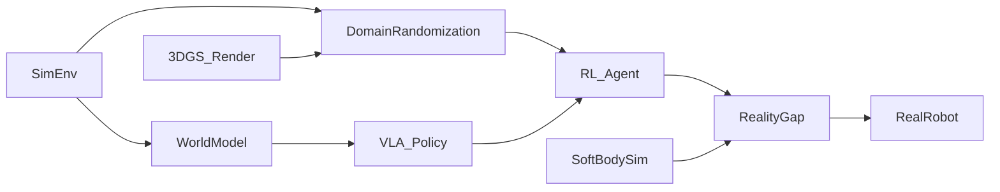

# 🧭 Sim-to-Real Transfer（Theme_Sim2Real）

## 🎯 主题定义
- 归属上位关键词：**Theme_Embodied_AI_System**
- 细分关注：sim-to-real, simulation, domain randomization, reality gap
- 标准标签参考：#Sim2Real #Domain_Adaptation

## 📊 主题仪表盘
- 总论文数：**23**
- 平均分：**7.17**
- 高频标签：#Embodied_AI #Robot_Manipulation #Sim2Real #World_Model #VLA #Foundation_Model #Reinforcement_Learning #LLM #Diffusion_Model #3D_Gaussian_Splatting

## 🆕 最近新增
- [[HiVLA]] | 2026-04-15 | HiVLA: A Visual-Grounded-Centric Hierarchical Embodied Manipulation System
- [[SoftMimicGen]] | 2026-03-26 | SoftMimicGen: A Data Generation System for Scalable Robot Learning in Deformable Object Manipulation
- [[ProbeFlow]] | 2026-03-18 | ProbeFlow: Training-Free Adaptive Flow Matching for Vision-Language-Action Models
- [[Kinema4D]] | 2026-03-17 | Kinema4D: Kinematic 4D World Modeling for Spatiotemporal Embodied Simulation
- [[TiPToP]] | 2026-03-10 | TiPToP: A Modular Open-Vocabulary Planning System for Robotic Manipulation
- [[Emerging Extrinsic Dexterity in Cluttered Scenes via Dynamicsaware Policy Learning]] | 2026-03-10 | Emerging Extrinsic Dexterity in Cluttered Scenes via Dynamics-aware Policy Learning
- [[Chain of World]] | 2026-03-03 | Chain of World: World Model Thinking in Latent Motion
- [[LoGeR]] | 2026-03-03 | LoGeR: Long-Context Geometric Reconstruction with Hybrid Memory

## ⭐ 核心论文 Top
- [[Chain of World]] | Score: 8/10 | 2026-03-03 | Chain of World: World Model Thinking in Latent Motion
- [[FlowHOI]] | Score: 8/10 | 2026-02-13 | FlowHOI: Flow-based Semantics-Grounded Generation of Hand-Object Interactions for Dexterous Robot Manipulation
- [[HydroShear]] | Score: 8/10 | 2026-02-28 | HydroShear: Hydroelastic Shear Simulation for Tactile Sim-to-Real Reinforcement Learning
- [[Kinema4D]] | Score: 8/10 | 2026-03-17 | Kinema4D: Kinematic 4D World Modeling for Spatiotemporal Embodied Simulation
- [[LoGeR]] | Score: 8/10 | 2026-03-03 | LoGeR: Long-Context Geometric Reconstruction with Hybrid Memory
- [[ProbeFlow]] | Score: 8/10 | 2026-03-18 | ProbeFlow: Training-Free Adaptive Flow Matching for Vision-Language-Action Models
- [[SIMART]] | Score: 8/10 | Unknown | SIMART: Decomposing Monolithic Meshes into Sim-ready Articulated Assets via MLLM
- [[SoftMimicGen]] | Score: 8/10 | 2026-03-26 | SoftMimicGen: A Data Generation System for Scalable Robot Learning in Deformable Object Manipulation
- [[TICVLA]] | Score: 8/10 | 2026-02-02 | TIC-VLA: A Think-in-Control Vision-Language-Action Model for Robot Navigation in Dynamic Environments
- [[TiPToP]] | Score: 8/10 | 2026-03-10 | TiPToP: A Modular Open-Vocabulary Planning System for Robotic Manipulation
- [[ULTRA]] | Score: 8/10 | 2026-03-03 | ULTRA: Unified Multimodal Control for Autonomous Humanoid Whole-Body Loco-Manipulation
- [[World_Reasoning_Arena]] | Score: 8/10 | Unknown | World Reasoning Arena

## ✅ 核心贡献与共识
- 暂无可提取的核心贡献，待深度分析笔记积累后自动汇总。

## ⚠️ 局限性与关键分歧
- 暂未发现显式局限性记录，待深度分析笔记积累后自动汇总。

## 🔀 跨论文引用网络
- [[2026-02-26-PaperDigest]] ← 被 [[Xiaomi-Robotics-0]], [[Solaris]], [[SPARR]] 等 3 篇引用
- [[Solaris]] ← 被 [[Xiaomi-Robotics-0]], [[Solaris]], [[SPARR]] 等 3 篇引用
- [[GeneralVLA]] ← 被 [[FlowHOI]], [[SemanticContact_Fields_for_CategoryLevel_Generalizable_Tactile_Tool_Manipulation]] 等 2 篇引用
- [[World_Action_Models_are_Zero_shot_Policies]] ← 被 [[LoGeR]], [[SemanticContact_Fields_for_CategoryLevel_Generalizable_Tactile_Tool_Manipulation]] 等 2 篇引用
- [[README]] ← 被 [[Xiaomi-Robotics-0]], [[SPARR]] 等 2 篇引用
- [[Physics Informed Viscous Value Representations]] ← 被 [[Xiaomi-Robotics-0]], [[SemanticContact_Fields_for_CategoryLevel_Generalizable_Tactile_Tool_Manipulation]] 等 2 篇引用
- [[Mean_Flow_Policy_with_Instantaneous_Velocity_Constraint_for_Onestep_Action_Generation]] ← 被 [[FlowHOI]] 等 1 篇引用
- [[SemanticContact_Fields_for_CategoryLevel_Generalizable_Tactile_Tool_Manipulation]] ← 被 [[FlowHOI]] 等 1 篇引用

## 🏛️ 领域里程碑工作（AI Enriched）
- **Domain Randomization for Transferring Deep Neural Networks from Simulation to the Real World (2017, RSS)** — Established domain randomization as a foundational strategy to bridge the reality gap by training policies on randomized visual and physical parameters.
- **CAD2RL: Real Single-Image Flight without a Single Real Pixel (2017, RSS)** — Demonstrated that purely simulated training with heavy visual randomization could yield zero-shot real-world drone navigation.
- **Learning Dexterous In-Hand Manipulation (2019, IJRR)** — Proved that complex dexterous manipulation policies trained entirely in simulation could transfer to physical Shadow Hands using massive parallelization and domain randomization.
- **Rapid Motor Adaptation for Legged Robots (2021, RSS)** — Introduced a privileged learning framework with an online adaptation module, enabling legged robots to instantly adapt to unseen terrains and payloads in the real world.
- **Isaac Gym: High Performance GPU-Based Physics Simulation For Robot Learning (2021, NeurIPS)** — Revolutionized sim-to-real scalability by enabling massively parallelized physics simulation on GPUs, drastically reducing training time for RL policies.
- **Sim-to-Real Transfer of Robotic Control with Dynamics Randomization (2018, ICRA)** — Pioneered the use of dynamics randomization for humanoid and quadruped locomotion, showing robustness to real-world friction and mass variations.
- **Closing the Sim-to-Real Gap: Learning to Walk with Deep Reinforcement Learning (2018, ICRA)** — Systematically analyzed the reality gap in locomotion and introduced curriculum learning and system identification techniques to improve transfer fidelity.
- **RoboCat: A Self-Improving Foundation Agent for Robotic Manipulation (2023, ArXiv)** — Demonstrated a self-improving loop where a foundation model trained on diverse simulated and real data continuously enhances its sim-to-real transfer capabilities.
- **RT-2: Vision-Language-Action Models Transfer Web Knowledge to Robotic Control (2023, CoRL)** — Showed that large-scale vision-language models fine-tuned on robotic data can generalize zero-shot to novel real-world objects and instructions.
- **Diffusion Policy: Visuomotor Policy Learning via Action Diffusion (2023, RSS)** — Established diffusion models as a highly effective paradigm for generating robust, multi-modal action distributions that transfer reliably from simulation to real-world manipulation.
- **Gen2: Generalist Robot Policy with Generative World Models (2024, ICRA)** — Leveraged generative world models to predict future states and actions, significantly improving policy robustness during sim-to-real deployment under distribution shifts.
- **VoxPoser: Composable 3D Value Maps for Robotic Manipulation with Language Models (2023, CoRL)** — Combined LLM reasoning with 3D spatial value maps to enable zero-shot sim-to-real task planning and execution in unstructured environments.

## 🚀 前沿信号雷达（AI Enriched）
- HydroShear 代表了利用流体与软体动力学随机化（Dynamics Randomization）来增强复杂接触与形变场景下策略鲁棒性的技术趋势。
- LoGeR 与 Kinema4D 展示了基于 World Model 的隐空间对齐与高保真状态预测，正逐步替代传统参数随机化以系统性缩小表征层面的 Reality Gap。
- SIMART 与 FlowHOI 标志着 3D Gaussian Splatting 技术被引入仿真管线，通过可微高保真渲染实现视觉域的快速自适应与零样本迁移。
- TICVLA 与 ProbeFlow 揭示了 Vision-Language-Action (VLA) 架构与 Reinforcement Learning 的深度融合趋势，利用大模型的语义先验直接约束动作空间以降低真实部署的探索成本。

## 🧬 体系化关联补充（AI Enriched）
- Sim-to-Real ↔ World_Model: 以 LoGeR 为代表，通过构建可微分的世界模型将仿真物理先验编码为隐状态表征，实现跨域状态预测与策略蒸馏，打通了高保真仿真与真实环境动态建模的桥梁。
- Sim-to-Real ↔ VLA/Foundation_Model: 以 TICVLA 和 TiPToP 为纽带，利用 VLA 架构的跨模态语义对齐能力，将仿真中优化的动作分布与真实世界的自然语言指令绑定，形成从高层逻辑推理到底层运动控制的端到端迁移路径。
- Sim-to-Real ↔ 3D_Gaussian_Splatting: 依托 SIMART 引入的 3D Gaussian Splatting 技术，在仿真管线中实现可微的高保真场景重建与渲染，为视觉策略提供了像素级域自适应的底层数据桥梁。
- Sim-to-Real ↔ Reinforcement_Learning: 通过 ULTRA 和 HydroShear 的大规模并行 RL 训练与动力学随机化机制，在仿真中生成覆盖真实物理约束的轨迹分布，直接作为真实机械臂零样本部署的策略初始化桥梁。

## ❓ 开放性问题（AI Enriched）
- 结合世界模型与具身智能的Sim-to-Real方法中，如何量化并补偿多步预测误差在真实物理环境中的累积效应？
- 基于3D高斯溅射的仿真渲染虽具备高保真视觉，但缺乏显式物理属性，如何在不引入昂贵物理引擎的前提下实现视觉-动力学联合域随机化？
- 大语言模型与视觉语言动作模型在Sim-to-Real迁移时，如何设计轻量级的底层策略适配器以应对真实传感器噪声与执行器延迟？
- 面对高度非线性的柔性物体操作，传统的域随机化策略为何难以覆盖真实接触动力学的长尾分布，应如何构建数据驱动的自适应域泛化机制？

## 🗺️ 主题关系可视化（AI Enriched）

## 🗓️ 本周推进建议（AI Enriched）
- [ ] 聚焦HydroShear中的域随机化策略。在PyBullet中搭建单臂抓取方块环境，仅用<200行代码实现PPO算法，并在训练时随机化方块质量与接触摩擦系数。观察指标：记录策略在固定真实参数与极端随机参数下的抓取成功率差异，验证DR对现实差距的鲁棒性提升。
- [ ] 聚焦Chain of World的世界模型预测机制。使用Jupyter Notebook加载公开的小型机器人轨迹数据集，用两层MLP拟合状态转移函数，并进行50步自回归推演。观察指标：绘制预测轨迹与真实轨迹的均方误差(MSE)随时间步的增长曲线，分析长程预测中的误差累积现象。
- [ ] 聚焦SIMART中3D高斯溅射的视觉保真特性。利用开源轻量级3DGS库（如gsplat）渲染单一静态物体的多视角图像，并计算相邻视角的光流场。观察指标：对比渲染光流与基于相机位姿解析计算的理论光流差异，量化纯视觉仿真在缺乏物理约束时的几何漂移程度。

## 🔗 关联主题
- [[Theme_Embodied_AI_System|Embodied AI Systems]]
- [[Theme_RL_Algorithms|Reinforcement Learning Algorithms]]
- [[Theme_Robot_Manipulation_General|Robot Manipulation]]
