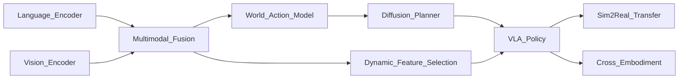

# 🧭 Vision-Language-Action Policies（Theme_VLA_Policy）

## 🎯 主题定义
- 归属上位关键词：**Theme_Embodied_AI_System**
- 细分关注：VLA, vision-language-action, multimodal policy, language-conditioned, instruction following
- 标准标签参考：#VLA #Multimodal_Policy

## 📊 主题仪表盘
- 总论文数：**31**
- 平均分：**7.58**
- 高频标签：#VLA #Embodied_AI #Robot_Manipulation #Foundation_Model #LLM #World_Model #Diffusion_Model #Sim2Real #Reinforcement_Learning #Foundation_Models

## 🆕 最近新增
- [[HiVLA]] | 2026-04-15 | HiVLA: A Visual-Grounded-Centric Hierarchical Embodied Manipulation System
- [[TAG]] | 2026-03-25 | TAG: Target-Agnostic Guidance for Stable Object-Centric Inference in Vision-Language-Action Models
- [[VTAM]] | 2026-03-24 | VTAM: Video-Tactile-Action Models for Complex Physical Interaction Beyond VLAs
- [[Not All Features Are Created Equal]] | 2026-03-19 | Not All Features Are Created Equal: A Mechanistic Study of Vision-Language-Action Models
- [[FASTER]] | 2026-03-19 | FASTER: Rethinking Real-Time Flow VLAs
- [[ProbeFlow]] | 2026-03-18 | ProbeFlow: Training-Free Adaptive Flow Matching for Vision-Language-Action Models
- [[Towards Generalizable Robotic Manipulation in Dynamic Environments]] | 2026-03-16 | Towards Generalizable Robotic Manipulation in Dynamic Environments
- [[Simple Recipe Works]] | 2026-03-12 | Simple Recipe Works: Vision-Language-Action Models are Natural Continual Learners with Reinforcement Learning

## ⭐ 核心论文 Top
- [[Not All Features Are Created Equal]] | Score: 9/10 | 2026-03-19 | Not All Features Are Created Equal: A Mechanistic Study of Vision-Language-Action Models
- [[RISE]] | Score: 9/10 | 2026-02-11 | RISE: Self-Improving Robot Policy with Compositional World Model
- [[Simple Recipe Works]] | Score: 9/10 | 2026-03-12 | Simple Recipe Works: Vision-Language-Action Models are Natural Continual Learners with Reinforcement Learning
- [[World_Action_Models_are_Zero_shot_Policies]] | Score: 9/10 | 2026-02-19 | World Action Models are Zero-shot Policies
- [[Beyond Language Modeling]] | Score: 8/10 | 2026-03-03 | Beyond Language Modeling: An Exploration of Multimodal Pretraining
- [[Chain of World]] | Score: 8/10 | 2026-03-03 | Chain of World: World Model Thinking in Latent Motion
- [[FASTER]] | Score: 8/10 | 2026-03-19 | FASTER: Rethinking Real-Time Flow VLAs
- [[FlowHOI]] | Score: 8/10 | 2026-02-13 | FlowHOI: Flow-based Semantics-Grounded Generation of Hand-Object Interactions for Dexterous Robot Manipulation
- [[HybridVLA]] | Score: 8/10 | 2025-06-23 | HybridVLA: Collaborative Diffusion and Autoregression in a Unified Vision-Language-Action Model
- [[OmniStream]] | Score: 8/10 | 2026-03-12 | OmniStream: Mastering Perception, Reconstruction and Action in Continuous Streams
- [[ProbeFlow]] | Score: 8/10 | 2026-03-18 | ProbeFlow: Training-Free Adaptive Flow Matching for Vision-Language-Action Models
- [[RoboMME]] | Score: 8/10 | 2026-03-04 | RoboMME: Benchmarking and Understanding Memory for Robotic Generalist Policies

## ✅ 核心贡献与共识
- 暂无可提取的核心贡献，待深度分析笔记积累后自动汇总。

## ⚠️ 局限性与关键分歧
- 暂未发现显式局限性记录，待深度分析笔记积累后自动汇总。

## 🔀 跨论文引用网络
- [[GeneralVLA]] ← 被 [[RISE]], [[World_Action_Models_are_Zero_shot_Policies]], [[FlowHOI]] 等 5 篇引用
- [[Physics Informed Viscous Value Representations]] ← 被 [[RISE]], [[Xiaomi-Robotics-0]], [[SemanticContact_Fields_for_CategoryLevel_Generalizable_Tactile_Tool_Manipulation]] 等 4 篇引用
- [[GeometryAware_Rotary_Position_Embedding_for_Consistent_Video_World_Model]] ← 被 [[RISE]], [[Utonia]] 等 2 篇引用
- [[World_Action_Models_are_Zero_shot_Policies]] ← 被 [[RISE]], [[SemanticContact_Fields_for_CategoryLevel_Generalizable_Tactile_Tool_Manipulation]] 等 2 篇引用
- [[QuantVLA]] ← 被 [[World_Action_Models_are_Zero_shot_Policies]], [[Utonia]] 等 2 篇引用
- [[SemanticContact_Fields_for_CategoryLevel_Generalizable_Tactile_Tool_Manipulation]] ← 被 [[FlowHOI]], [[Utonia]] 等 2 篇引用
- [[ProbeFlow]] ← 被 [[HybridVLA]], [[HiVLA]] 等 2 篇引用
- [[README]] ← 被 [[Xiaomi-Robotics-0]], [[GeneralVLA]] 等 2 篇引用

## 🏛️ 领域里程碑工作（AI Enriched）
- **CLIPort (2021, CoRL)** — Introduced language-conditioned robotic manipulation by combining CLIP's semantic grounding with Transporter Networks, establishing the first scalable pipeline for zero-shot instruction following in pick-and-place tasks.
- **SayCan (2022, arXiv/Google Research)** — Demonstrated how large language models can be grounded in physical affordances to generate feasible, high-level plans, bridging the gap between abstract language reasoning and low-level robotic execution.
- **RT-1 (2022, CoRL)** — Pioneered the use of a transformer-based architecture trained on a massive, diverse robotics dataset to learn a generalist policy capable of executing hundreds of language-conditioned tasks with high robustness.
- **R3M (2022, NeurIPS)** — Developed a universal visual representation for robotics by pretraining on human video datasets, providing a foundational visual encoder that significantly boosted sample efficiency for downstream language-conditioned policies.
- **VIMA (2022, NeurIPS)** — Unified multimodal robotic tasks into a single sequence modeling framework using a transformer, proving that diverse perception-action problems can be solved through standardized tokenization and autoregressive generation.
- **PaLM-E (2023, ICML)** — Integrated a large vision-language model directly into a robotic control loop, proving that end-to-end multimodal LLMs can perform embodied reasoning and continuous action generation without intermediate symbolic planners.
- **RT-2 (2023, arXiv/Google DeepMind)** — Formally established the Vision-Language-Action (VLA) paradigm by fine-tuning web-scale vision-language models on robotics data, enabling emergent semantic reasoning and cross-embodiment generalization.
- **Open X-Embodiment (2023, arXiv)** — Released the largest multi-robot dataset to date, providing the critical data infrastructure that enabled the training and benchmarking of scalable, cross-embodiment VLA policies.
- **Diffusion Policy (2023, RSS)** — Replaced deterministic action heads with conditional diffusion models for policy learning, dramatically improving multi-modal action distribution modeling and temporal consistency in contact-rich manipulation.
- **RoboCat (2023, arXiv/DeepMind)** — Showcased a self-improving VLA agent that leverages synthetic data and automated data collection to rapidly adapt to new embodiments and tasks, highlighting the scalability of foundation models in robotics.
- **Octo (2024, arXiv)** — Introduced a modular, open-source generalist robot policy trained on diverse datasets, demonstrating that architecture-agnostic pretraining and fine-tuning can yield highly adaptable VLA systems across varied hardware.
- **OpenVLA (2024, arXiv)** — Delivered a fully open-source, 7B-parameter VLA model optimized for real-time inference, democratizing access to foundation-model-based robotic control and establishing a new baseline for community-driven VLA research.

## 🚀 前沿信号雷达（AI Enriched）
- **World Action Models are Zero-shot Policies** 代表了将 Video Diffusion Model 重构为 World Action Model 的技术趋势，通过隐式物理动力学建模实现 VLA 策略的零样本跨本体迁移。
- **FASTER** 揭示了利用 Diffusion Model 替代传统自回归解码器的趋势，显著提升了 VLA 策略在 Robot Manipulation 中的高频动作生成效率与多模态分布拟合能力。
- **FlowHOI** 标志着 3D Gaussian Splatting 与 VLA 架构的深度融合趋势，通过显式三维场景表征增强策略对复杂 Human-Object Interaction 的空间理解与精细控制。
- **Chain of World** 体现了将 Chain-of-Thought 推理机制引入 World Model 的趋势，使 VLA 策略能够在长程 Embodied AI 任务中实现可解释的多步状态预测与规划。

## 🧬 体系化关联补充（AI Enriched）
- **World Action Models are Zero-shot Policies** 通过 Video Diffusion Model 构建了 VLA 策略与 World Model 主题的技术桥梁，将视觉生成先验转化为可微分的物理动力学模拟器，支撑跨主题的动作预测与规划。
- **RISE** 与 **Simple Recipe Works** 共同建立了 VLA 策略与 Reinforcement Learning 主题的桥梁，利用 Foundation Model 提供的强表征初始化 RL 策略，大幅降低在线探索成本并提升样本效率。
- **FlowHOI** 与 **OmniStream** 搭建了 VLA 策略与 3D Scene Representation 主题的桥梁，通过引入 3D Gaussian Splatting 与多模态流式处理，将二维视觉指令映射为三维空间可执行的动作序列。
- **ProbeFlow** 明确了 VLA 策略与 Sim2Real Transfer 主题的技术连接，利用 Flow Matching 与域自适应技术弥合仿真与真实环境的动力学差异，保障语言条件策略的零样本部署。

## ❓ 开放性问题（AI Enriched）
- 针对现有VLA策略在跨具身迁移中暴露的动作空间与运动学不匹配局限，如何设计轻量级适配器以在不重训视觉-语言骨干网络的前提下实现零样本泛化？
- 鉴于世界模型与扩散策略在长程规划中常产生物理不一致或动力学断裂的局限，如何嵌入可微分的轻量级物理约束以在保持生成多样性的同时提升轨迹可行性？
- 面对多模态特征融合时普遍存在的特征冗余与冲突局限，如何构建动态路由机制使策略网络能依据指令语义自动聚焦关键视觉区域与动作维度，从而突破高延迟推理瓶颈？

## 🗺️ 主题关系可视化（AI Enriched）

## 🗓️ 本周推进建议（AI Enriched）
- [ ] 聚焦[Not All Features Are Created Equal]的特征选择机制：在Jupyter中使用预训练CLIP提取简单场景图像特征，实现基于注意力权重的Top-K特征过滤模块（<100行代码）。观察并记录过滤前后特征矩阵的方差变化，以及将过滤后特征输入轻量级分类器时的准确率波动，验证“非所有特征同等重要”的假设。
- [ ] 聚焦[World_Action_Models_are_Zero_shot_Policies]的状态预测能力：利用公开的小型机器人轨迹CSV数据，用PyTorch搭建基于Transformer的简单状态预测模型（<150行代码），输入当前关节角预测下一帧状态。测量预测误差（MSE）随时间步长的衰减曲线，分析世界模型在长程预测中的误差累积现象。
- [ ] 聚焦[FASTER]的扩散动作解码原理：在笔记本中实现一维条件流匹配（Conditional Flow Matching）或简化版DDPM，用于从噪声生成简单的2D机械臂轨迹。对比不同条件强度（如语言嵌入缩放系数）对生成轨迹平滑度与目标点命中率的影响，记录并绘制轨迹分布散点图，理解扩散策略的条件控制机制。

## 🔗 关联主题
- [[Theme_VLA_Reasoning|VLA Reasoning & Planning]]
- [[Theme_Foundation_LLM|Foundation LLMs & Language Models]]
- [[Theme_Diffusion_Policy|Diffusion-Based Policies]]
- [[Theme_World_Model_Dynamics|World Models & Dynamics Prediction]]
