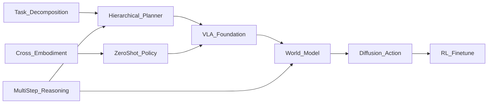

# 🧭 VLA Reasoning & Planning（Theme_VLA_Reasoning）

## 🎯 主题定义
- 归属上位关键词：**Theme_VLA_Policy**
- 细分关注：reasoning, planning, task decomposition, hierarchical, multi-step
- 标准标签参考：#VLA #Planning

## 📊 主题仪表盘
- 总论文数：**50**
- 平均分：**7.46**
- 高频标签：#Embodied_AI #Robot_Manipulation #VLA #Foundation_Model #World_Model #LLM #Diffusion_Model #Reinforcement_Learning #Sim2Real #Foundation_Models

## 🆕 最近新增
- [[HiVLA]] | 2026-04-15 | HiVLA: A Visual-Grounded-Centric Hierarchical Embodied Manipulation System
- [[DreamerAD]] | 2026-03-25 | DreamerAD: Efficient Reinforcement Learning via Latent World Model for Autonomous Driving
- [[TAG]] | 2026-03-25 | TAG: Target-Agnostic Guidance for Stable Object-Centric Inference in Vision-Language-Action Models
- [[VTAM]] | 2026-03-24 | VTAM: Video-Tactile-Action Models for Complex Physical Interaction Beyond VLAs
- [[Not All Features Are Created Equal]] | 2026-03-19 | Not All Features Are Created Equal: A Mechanistic Study of Vision-Language-Action Models
- [[FASTER]] | 2026-03-19 | FASTER: Rethinking Real-Time Flow VLAs
- [[Generation_Models_Know_Space]] | 2026-03-19 | Generation Models Know Space: Unleashing Implicit 3D Priors for Scene Understanding
- [[ProbeFlow]] | 2026-03-18 | ProbeFlow: Training-Free Adaptive Flow Matching for Vision-Language-Action Models

## ⭐ 核心论文 Top
- [[Not All Features Are Created Equal]] | Score: 9/10 | 2026-03-19 | Not All Features Are Created Equal: A Mechanistic Study of Vision-Language-Action Models
- [[RISE]] | Score: 9/10 | 2026-02-11 | RISE: Self-Improving Robot Policy with Compositional World Model
- [[Simple Recipe Works]] | Score: 9/10 | 2026-03-12 | Simple Recipe Works: Vision-Language-Action Models are Natural Continual Learners with Reinforcement Learning
- [[World_Action_Models_are_Zero_shot_Policies]] | Score: 9/10 | 2026-02-19 | World Action Models are Zero-shot Policies
- [[ACEBrain0]] | Score: 8/10 | 2026-03-04 | ACE-Brain-0: Spatial Intelligence as a Shared Scaffold for Universal Embodiments
- [[Beyond Language Modeling]] | Score: 8/10 | 2026-03-03 | Beyond Language Modeling: An Exploration of Multimodal Pretraining
- [[Chain of World]] | Score: 8/10 | 2026-03-03 | Chain of World: World Model Thinking in Latent Motion
- [[DreamerAD]] | Score: 8/10 | 2026-03-25 | DreamerAD: Efficient Reinforcement Learning via Latent World Model for Autonomous Driving
- [[DreamPlan]] | Score: 8/10 | 2026-03-17 | DreamPlan: Efficient Reinforcement Fine-Tuning of Vision-Language Planners via Video World Models
- [[EmboAlign]] | Score: 8/10 | 2026-03-05 | EmboAlign: Aligning Video Generation with Compositional Constraints for Zero-Shot Manipulation
- [[FASTER]] | Score: 8/10 | 2026-03-19 | FASTER: Rethinking Real-Time Flow VLAs
- [[FlowHOI]] | Score: 8/10 | 2026-02-13 | FlowHOI: Flow-based Semantics-Grounded Generation of Hand-Object Interactions for Dexterous Robot Manipulation

## ✅ 核心贡献与共识
- 暂无可提取的核心贡献，待深度分析笔记积累后自动汇总。

## ⚠️ 局限性与关键分歧
- 暂未发现显式局限性记录，待深度分析笔记积累后自动汇总。

## 🔀 跨论文引用网络
- [[GeneralVLA]] ← 被 [[RISE]], [[World_Action_Models_are_Zero_shot_Policies]], [[FlowHOI]] 等 6 篇引用
- [[Physics Informed Viscous Value Representations]] ← 被 [[RISE]], [[The_Trinity_of_Consistency_as_a_Defining_Principle_for_General_World_Models]], [[Xiaomi-Robotics-0]] 等 5 篇引用
- [[World_Action_Models_are_Zero_shot_Policies]] ← 被 [[RISE]], [[LoGeR]], [[The_Trinity_of_Consistency_as_a_Defining_Principle_for_General_World_Models]] 等 4 篇引用
- [[QuantVLA]] ← 被 [[World_Action_Models_are_Zero_shot_Policies]], [[The_Trinity_of_Consistency_as_a_Defining_Principle_for_General_World_Models]], [[Utonia]] 等 3 篇引用
- [[GeometryAware_Rotary_Position_Embedding_for_Consistent_Video_World_Model]] ← 被 [[RISE]], [[Utonia]] 等 2 篇引用
- [[Code2Worlds]] ← 被 [[World_Action_Models_are_Zero_shot_Policies]], [[The_Trinity_of_Consistency_as_a_Defining_Principle_for_General_World_Models]] 等 2 篇引用
- [[SemanticContact_Fields_for_CategoryLevel_Generalizable_Tactile_Tool_Manipulation]] ← 被 [[FlowHOI]], [[Utonia]] 等 2 篇引用
- [[ProbeFlow]] ← 被 [[HybridVLA]], [[HiVLA]] 等 2 篇引用

## 🏛️ 领域里程碑工作（AI Enriched）
- **Do As I Can, Not As I Say: Grounding Language in Robotic Affordances (2022, CoRL)** — Established LLM-based semantic planning grounded in learned affordance scores, enabling reliable multi-step task decomposition for real-world manipulation.
- **Code as Policies: Language Model Programs for Embodied Control (2023, ICRA)** — Demonstrated that generating executable code from LLMs enables zero-shot hierarchical planning and dynamic tool use, bridging high-level reasoning with low-level execution.
- **Inner Monologue: Embodied Reasoning through Planning with Language Models (2022, CoRL)** — Introduced closed-loop feedback between high-level LLM planners and low-level controllers, enabling robust error recovery and multi-step reasoning in dynamic environments.
- **RT-1: Robotics Transformer for Real-World Control at Scale (2022, CoRL)** — Pioneered tokenized action sequence modeling with transformers, establishing the architectural baseline for modern VLA policy execution and scalable imitation learning.
- **PaLM-E: An Embodied Multimodal Language Model (2023, ICML)** — Integrated visual-language reasoning directly into continuous control, eliminating the need for intermediate symbolic planners and enabling end-to-end reasoning across modalities.
- **RT-2: Vision-Language-Action Models Transfer Web Knowledge to Robotic Control (2023, CoRL)** — Showed that fine-tuning VLMs on robotic data yields emergent semantic reasoning and zero-shot generalization to novel instructions and unseen objects.
- **ProgPrompt: Generating Situated Robot Task Plans using Large Language Models (2023, ICRA)** — Formalized the use of LLMs to generate structured, executable task plans with environmental grounding, bridging high-level reasoning and low-level execution.
- **AutoRT: Scaling Robot Learning with LLMs (2023, RSS)** — Automated data collection and policy training via LLM-driven task generation and verification, demonstrating scalable reasoning-to-policy pipelines for diverse manipulation tasks.
- **Octo: An Open-Source Generalist Robot Policy (2024, RSS)** — Proved that multi-robot, multi-task pretraining with a unified VLA architecture enables strong zero-shot planning and cross-embodiment adaptation without task-specific fine-tuning.
- **OpenVLA: An Open-Source Vision-Language-Action Model (2024, CoRL)** — Provided a fully open, fine-tunable VLA baseline that democratized research into reasoning-driven policy distillation and hierarchical control across academic labs.
- **Chain of Thought Prompting Elicits Reasoning in Large Language Models (2022, NeurIPS)** — Established the foundational prompting paradigm that became the de facto standard for decomposing complex robotic tasks into sequential, verifiable sub-goals.
- **LLM-Planner: Few-Shot Grounded Planning for Embodied Agents with Large Language Models (2023, ICCV)** — Integrated LLM planners with visual grounding modules to enable robust multi-step navigation and manipulation in unseen environments through semantic reasoning.

## 🚀 前沿信号雷达（AI Enriched）
- **World_Action_Models_are_Zero_shot_Policies** 代表了将 World Model 直接作为 Zero-shot Policy 生成器的趋势，通过 Video Diffusion Model 联合预测 State 与 Action，实现跨 Embodiment 的隐式 Planning。
- **Chain of World** 揭示了 Chain-of-Thought 风格的世界模型推理路径，通过多步 State Prediction 与 Action 解耦，显著提升长程 Multi-step Task 中的时序一致性与容错能力。
- **DreamPlan** 与 **DreamerAD** 共同指向 Latent Space Planning 趋势，利用 Diffusion Model 在隐空间进行 Trajectory Sampling 与 RL 优化，替代传统确定性规划器以处理高维连续控制。
- **Simple Recipe Works** 验证了极简 Hierarchical Task Decomposition 的有效性，表明通过轻量级 Prompt Engineering 与结构化指令映射即可在 VLA 中实现稳定的 Reasoning，降低了对复杂架构的依赖。

## 🧬 体系化关联补充（AI Enriched）
- 与 **Theme_VLA_Policy** 的技术桥梁：**Simple Recipe Works** 中的分层指令解析机制将高层 Semantic Reasoning 输出转化为低层 Policy 可执行的 Action Sequence，实现 Reasoning 到 Control 的无缝映射。
- 与 **Theme_World_Model** 的技术桥梁：**Chain of World** 和 **World_Action_Models_are_Zero_shot_Policies** 利用多步 State Prediction 构建内部 Simulation Environment，为 VLA 提供 Counterfactual Reasoning 能力，使 Planning 具备前瞻性验证。
- 与 **Theme_Diffusion_Model** 的技术桥梁：**DreamPlan** 和 **DreamerAD** 将 Diffusion Model 引入 Action Space Generation，通过 Conditional Trajectory Sampling 替代传统 Optimization Solver，实现高维连续控制下的多模态 Planning 分布建模。
- 与 **Theme_Foundation_Model** 的技术桥梁：**ACEBrain0** 和 **Beyond Language Modeling** 借助 LLM 的先验知识进行 Task Decomposition 与常识推理，为 Embodied AI 提供跨域泛化的 Semantic Anchor，弥补纯视觉策略的推理短板。

## ❓ 开放性问题（AI Enriched）
- 在长程多步任务中，基于世界模型的VLA规划如何有效抑制开环预测的误差累积与状态漂移，而不依赖昂贵的在线重规划？
- 当前VLA模型多依赖隐式推理进行任务分解，如何设计可解释的显式层次化规划模块，以提升复杂指令下的子目标对齐率？
- 扩散模型驱动的规划策略在推理延迟与动作平滑性之间存在权衡，如何在不牺牲实时性的前提下实现多模态条件的高效采样？
- 跨具身迁移中，零样本策略对未见机械臂构型的泛化瓶颈主要源于视觉表征对齐不足还是底层动力学先验缺失？

## 🗺️ 主题关系可视化（AI Enriched）

## 🗓️ 本周推进建议（AI Enriched）
- [ ] 针对[Chain of World]的世界模型多步预测一致性：在Jupyter中使用PyTorch构建一个轻量级Transformer序列预测器（<150行），输入公开机器人轨迹数据集的初始状态与动作序列，生成未来5步状态。观察并记录预测误差随步长增加的衰减曲线，对比开环预测与加入单步真实观测校正后的误差差异，验证长程规划中的误差累积现象。
- [ ] 针对[DreamPlan]的扩散模型潜在轨迹采样：在Jupyter中实现简化的一维高斯扩散过程（<100行），将目标坐标作为条件，使用DDIM算法采样生成从起点到终点的动作轨迹。改变采样步数（如5步、20步、50步），测量生成轨迹的曲率方差与终点位置误差，直观理解推理步数对规划平滑度与精度的影响。
- [ ] 针对[Simple Recipe Works]的LLM任务分解机制：本地部署轻量级开源LLM，输入包含3-4个子步骤的复杂操作指令，要求模型输出结构化JSON子任务列表。编写不超过50行的Python脚本将JSON映射为预设动作序列，观察不同指令复杂度下的逻辑连贯性得分，并测试单步失败时的简单回退策略触发率。
- [ ] 针对[World_Action_Models_are_Zero_shot_Policies]的跨具身零样本迁移：使用预训练的视频扩散模型提取动作先验，在Jupyter中加载两个不同构型机械臂的公开演示数据集，计算两者在潜在空间中的特征分布距离（如MMD或余弦相似度，<200行）。观察分布重叠度与零样本策略在模拟环境中执行成功率的相关性，定位表征对齐瓶颈。

## 🔗 关联主题
- [[Theme_VLA_Policy|Vision-Language-Action Policies]]
- [[Theme_Foundation_LLM|Foundation LLMs & Language Models]]
- [[Theme_Model_Based_Planning|Model-Based Planning & Control]]
