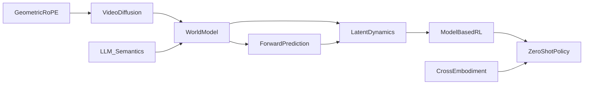

# 🧭 World Models & Dynamics Prediction（Theme_World_Model_Dynamics）

## 🎯 主题定义
- 归属上位关键词：**Theme_Embodied_AI_System**
- 细分关注：world model, dynamics, forward model, prediction, environment model
- 标准标签参考：#World_Model #Dynamics

## 📊 主题仪表盘
- 总论文数：**43**
- 平均分：**7.33**
- 高频标签：#Embodied_AI #World_Model #Robot_Manipulation #Foundation_Model #VLA #Diffusion_Model #Reinforcement_Learning #LLM #Sim2Real #Video_Diffusion_Model

## 🆕 最近新增
- [[DreamerAD]] | 2026-03-25 | DreamerAD: Efficient Reinforcement Learning via Latent World Model for Autonomous Driving
- [[TAG]] | 2026-03-25 | TAG: Target-Agnostic Guidance for Stable Object-Centric Inference in Vision-Language-Action Models
- [[VTAM]] | 2026-03-24 | VTAM: Video-Tactile-Action Models for Complex Physical Interaction Beyond VLAs
- [[WildWorld]] | 2026-03-24 | WildWorld: A Large-Scale Dataset for Dynamic World Modeling with Actions and Explicit State toward Generative ARPG
- [[EgoForge]] | 2026-03-20 | EgoForge: Goal-Directed Egocentric World Simulator
- [[Generation_Models_Know_Space]] | 2026-03-19 | Generation Models Know Space: Unleashing Implicit 3D Priors for Scene Understanding
- [[DreamPlan]] | 2026-03-17 | DreamPlan: Efficient Reinforcement Fine-Tuning of Vision-Language Planners via Video World Models
- [[Kinema4D]] | 2026-03-17 | Kinema4D: Kinematic 4D World Modeling for Spatiotemporal Embodied Simulation

## ⭐ 核心论文 Top
- [[RISE]] | Score: 9/10 | 2026-02-11 | RISE: Self-Improving Robot Policy with Compositional World Model
- [[World_Action_Models_are_Zero_shot_Policies]] | Score: 9/10 | 2026-02-19 | World Action Models are Zero-shot Policies
- [[Beyond Language Modeling]] | Score: 8/10 | 2026-03-03 | Beyond Language Modeling: An Exploration of Multimodal Pretraining
- [[CanViT]] | Score: 8/10 | Unknown | CanViT: Toward Active-Vision Foundation Models
- [[Chain of World]] | Score: 8/10 | 2026-03-03 | Chain of World: World Model Thinking in Latent Motion
- [[DiReCT]] | Score: 8/10 | Unknown | DiReCT: Disentangled Regularization of Contrastive Trajectories for Physics-Refined Video Generation
- [[DreamerAD]] | Score: 8/10 | 2026-03-25 | DreamerAD: Efficient Reinforcement Learning via Latent World Model for Autonomous Driving
- [[DreamPlan]] | Score: 8/10 | 2026-03-17 | DreamPlan: Efficient Reinforcement Fine-Tuning of Vision-Language Planners via Video World Models
- [[EgoForge]] | Score: 8/10 | 2026-03-20 | EgoForge: Goal-Directed Egocentric World Simulator
- [[EmboAlign]] | Score: 8/10 | 2026-03-05 | EmboAlign: Aligning Video Generation with Compositional Constraints for Zero-Shot Manipulation
- [[Generation_Models_Know_Space]] | Score: 8/10 | 2026-03-19 | Generation Models Know Space: Unleashing Implicit 3D Priors for Scene Understanding
- [[GeometryAware_Rotary_Position_Embedding_for_Consistent_Video_World_Model]] | Score: 8/10 | 2026-02-24 | Geometry-Aware Rotary Position Embedding for Consistent Video World Model

## ✅ 核心贡献与共识
- 暂无可提取的核心贡献，待深度分析笔记积累后自动汇总。

## ⚠️ 局限性与关键分歧
- 暂未发现显式局限性记录，待深度分析笔记积累后自动汇总。

## 🔀 跨论文引用网络
- [[GeneralVLA]] ← 被 [[RISE]], [[World_Action_Models_are_Zero_shot_Policies]], [[GeometryAware_Rotary_Position_Embedding_for_Consistent_Video_World_Model]] 等 5 篇引用
- [[World_Action_Models_are_Zero_shot_Policies]] ← 被 [[RISE]], [[GeometryAware_Rotary_Position_Embedding_for_Consistent_Video_World_Model]], [[LoGeR]] 等 5 篇引用
- [[Physics Informed Viscous Value Representations]] ← 被 [[RISE]], [[The_Trinity_of_Consistency_as_a_Defining_Principle_for_General_World_Models]], [[SemanticContact_Fields_for_CategoryLevel_Generalizable_Tactile_Tool_Manipulation]] 等 4 篇引用
- [[QuantVLA]] ← 被 [[World_Action_Models_are_Zero_shot_Policies]], [[GeometryAware_Rotary_Position_Embedding_for_Consistent_Video_World_Model]], [[The_Trinity_of_Consistency_as_a_Defining_Principle_for_General_World_Models]] 等 3 篇引用
- [[2026-02-26-PaperDigest]] ← 被 [[Solaris]], [[SPARR]], [[GeneralVLA]] 等 3 篇引用
- [[Solaris]] ← 被 [[Solaris]], [[SPARR]], [[GeneralVLA]] 等 3 篇引用
- [[Code2Worlds]] ← 被 [[World_Action_Models_are_Zero_shot_Policies]], [[The_Trinity_of_Consistency_as_a_Defining_Principle_for_General_World_Models]] 等 2 篇引用
- [[Generated_Reality]] ← 被 [[World_Action_Models_are_Zero_shot_Policies]], [[GeometryAware_Rotary_Position_Embedding_for_Consistent_Video_World_Model]] 等 2 篇引用

## 🏛️ 领域里程碑工作（AI Enriched）
- **World Models (2018, NeurIPS Workshop)** — Established the paradigm of learning compact latent representations of environment dynamics to enable planning and control without direct environment interaction.
- **PlaNet: Learning Latent Dynamics for Planning from Pixels (2019, ICML)** — Demonstrated that model-based RL can achieve state-of-the-art sample efficiency on continuous control tasks by learning deterministic and stochastic latent dynamics.
- **Dream to Control: Learning Behaviors by Latent Imagination (2020, ICLR)** — Introduced Dreamer, which learns a unified latent dynamics model to perform policy optimization entirely in imagination, drastically reducing real-world sample requirements.
- **Mastering Atari with Discrete World Models (2021, ICLR)** — Proposed DreamerV2, utilizing discrete latent variables and improved architecture to achieve human-level performance on Atari solely through latent-space planning.
- **MuZero: Mastering Atari, Go, Chess and Shogi by Planning with a Learned Model (2020, Nature)** — Pioneered the integration of learned dynamics models with Monte Carlo Tree Search, proving that model-based planning can surpass model-free methods in complex domains.
- **Learning to Simulate Complex Physics with Graph Networks (2020, ICML)** — Pioneered the use of Graph Neural Networks (GNNs) as differentiable forward models for simulating complex physical systems like fluids and deformable objects.
- **SimPLe: A Simple Model-Based RL Algorithm (2019, NeurIPS)** — Early demonstration that video prediction models can serve as effective world models for sample-efficient reinforcement learning in discrete action spaces.
- **EfficientZero: Mastering Atari Games with Limited Data (2021, NeurIPS)** — Advanced model-based RL by combining self-supervised consistency regularization with learned dynamics to achieve superhuman performance with minimal data.
- **Genie: Generative Interactive Environments (2024, ICML)** — Demonstrated that large-scale video diffusion models can be trained as interactive world models capable of generating controllable, temporally consistent environments for agent training.
- **RoboCat: A Self-Improving Foundation Agent for Robotic Manipulation (2023, arXiv)** — Showed how a unified transformer-based architecture can learn cross-embodiment dynamics and generalize to novel robotic tasks through self-generated data.

## 🚀 前沿信号雷达（AI Enriched）
- **World_Action_Models_are_Zero_shot_Policies** 代表了将 Video Diffusion Model 直接作为 World Action Model 的趋势，通过跨具身迁移（Cross-Embodiment Transfer）实现零样本策略生成，模糊了环境预测与动作执行的边界。
- **Chain of World** 体现了基于 World Model 的长程推理趋势，通过链式预测机制将复杂机器人操作任务分解为可验证的子目标序列，提升 Embodied AI 在长视野规划中的可靠性。
- **GeometryAware_Rotary_Position_Embedding_for_Consistent_Video_World_Model** 标志着在视频世界模型中注入几何先验的趋势，利用改进的 Rotary Position Embedding 解决多视角下的时空一致性问题，为具身导航提供高保真环境表征。
- **DreamerAD** 与 **DreamPlan** 共同反映了 Diffusion Model 与 Model-Based RL 深度融合的趋势，利用扩散过程对高维动力学进行概率建模，显著提升了复杂操作任务中的轨迹规划鲁棒性。

## 🧬 体系化关联补充（AI Enriched）
- 通过 **World_Action_Models_are_Zero_shot_Policies** 中的 Video Diffusion Model 架构，本主题与 Vision-Language-Action (VLA) 主题建立桥梁，将环境动力学预测转化为跨具身平台的零样本策略生成，实现从“预测未来”到“直接决策”的范式统一。
- 借助 **EmboAlign** 的跨模态对齐机制，本主题与 Imitation Learning 主题相连，利用世界模型生成的合成动力学轨迹对真实机器人演示数据进行增强，有效缓解 Sim-to-Real 鸿沟并提升策略泛化能力。
- 基于 **Generation_Models_Know_Space** 的隐式空间表征学习，本主题与 3D Scene Understanding 主题形成技术闭环，证明大规模生成模型内部已编码物理空间先验，可直接用于具身系统的碰撞检测与路径规划。
- 通过 **DreamPlan** 中的 Diffusion-based 轨迹优化模块，本主题与 Motion Planning 主题深度耦合，将传统基于采样的规划器替换为可微分的概率动力学模型，实现端到端的闭环控制与实时重规划。

## ❓ 开放性问题（AI Enriched）
- 跨具身迁移中动力学失配问题：现有世界模型在零样本策略迁移时，如何在不重新训练底层动力学网络的前提下，有效补偿不同机器人形态与物理参数带来的状态转移偏差？
- 长程视频预测的几何一致性瓶颈：基于扩散模型的视频世界模型在生成多步未来帧时，如何突破2D像素级生成的局限，在隐空间中显式建模3D刚体约束以避免物理幻觉累积？
- 语义推理与连续动力学的对齐难题：大语言模型与动力学预测模块融合时，如何设计高效的误差反馈机制，防止高层语义规划的低频指令在底层连续控制中引发高频震荡或预测误差指数级放大？
- 潜空间规划的计算效率限制：在基于世界模型的强化学习中，如何在高维扩散潜空间内实现实时多步采样与价值评估，以平衡生成质量与策略推理延迟？

## 🗺️ 主题关系可视化（AI Enriched）

## 🗓️ 本周推进建议（AI Enriched）
- [ ] 聚焦论文《GeometryAware_Rotary_Position_Embedding_for_Consistent_Video_World_Model》中的几何感知位置编码。在Jupyter中实现2D RoPE并应用于16x16的图像块网格，计算并可视化不同空间距离下的注意力权重分布。观察：对比标准正弦位置编码，验证加入几何约束后长距离注意力是否呈现符合物理规律的各向异性衰减，而非均匀扩散。
- [ ] 聚焦论文《DreamerAD》中的潜变量前向动力学预测。使用PyTorch构建一个仅含两层MLP的微型世界模型，在CartPole-v1的离线轨迹数据上进行单步状态预测训练。观察：记录并绘制10步开环预测的轨迹误差（MSE）随时间步的增长曲线，对比有无动作条件输入时的误差发散速度，理解隐空间动力学建模的误差累积特性。
- [ ] 聚焦论文《World_Action_Models_are_Zero_shot_Policies》中的动作条件视频生成机制。利用预训练的小型视频扩散模型（或简化版VAE），输入固定初始帧与不同离散动作序列，生成未来帧序列。观察：计算生成序列与真实物理引擎模拟帧的SSIM指标，分析动作条件注入位置（如交叉注意力层）对生成轨迹物理合理性的影响。
- [ ] 聚焦论文《DiReCT》中的语言-动力学跨模态对齐。在Jupyter中搭建一个轻量级交叉注意力模块，将简单文本指令（如“向左移动”）映射到2D状态向量空间。观察：通过t-SNE可视化指令嵌入与对应状态轨迹的聚类情况，测量语义相似度与动力学响应的一致性，理解大模型语义如何约束底层状态转移。

## 🔗 关联主题
- [[Theme_Video_World_Model|Video World Models]]
- [[Theme_Model_Based_Planning|Model-Based Planning & Control]]
- [[Theme_RL_Algorithms|Reinforcement Learning Algorithms]]
